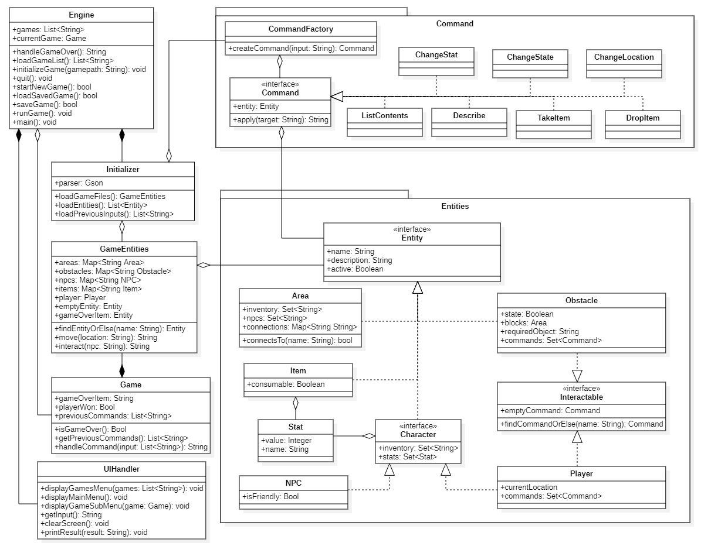
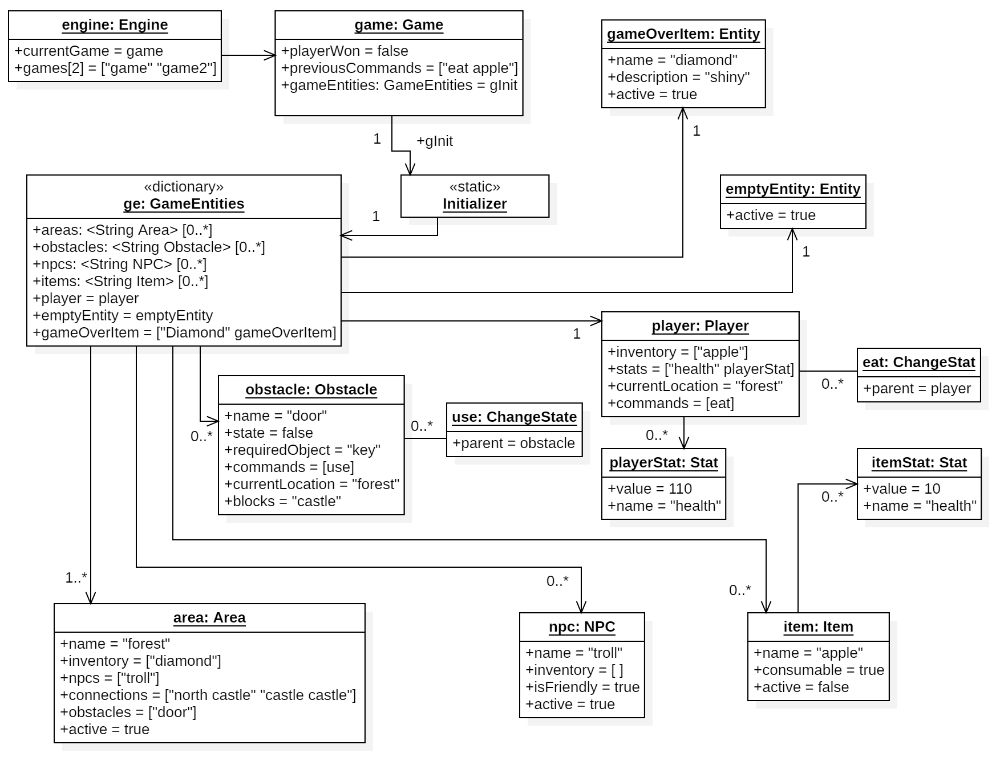
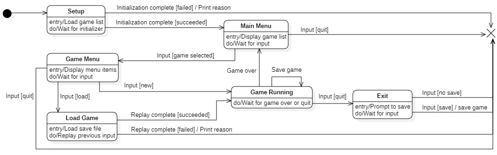
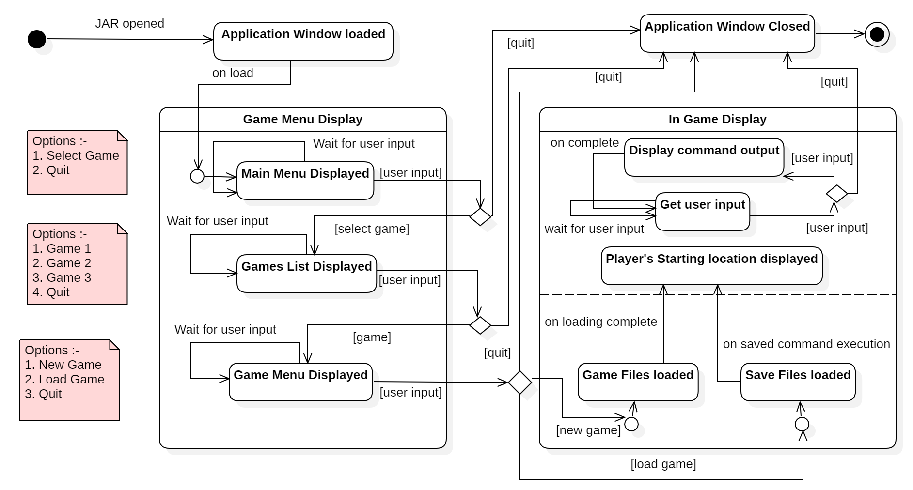
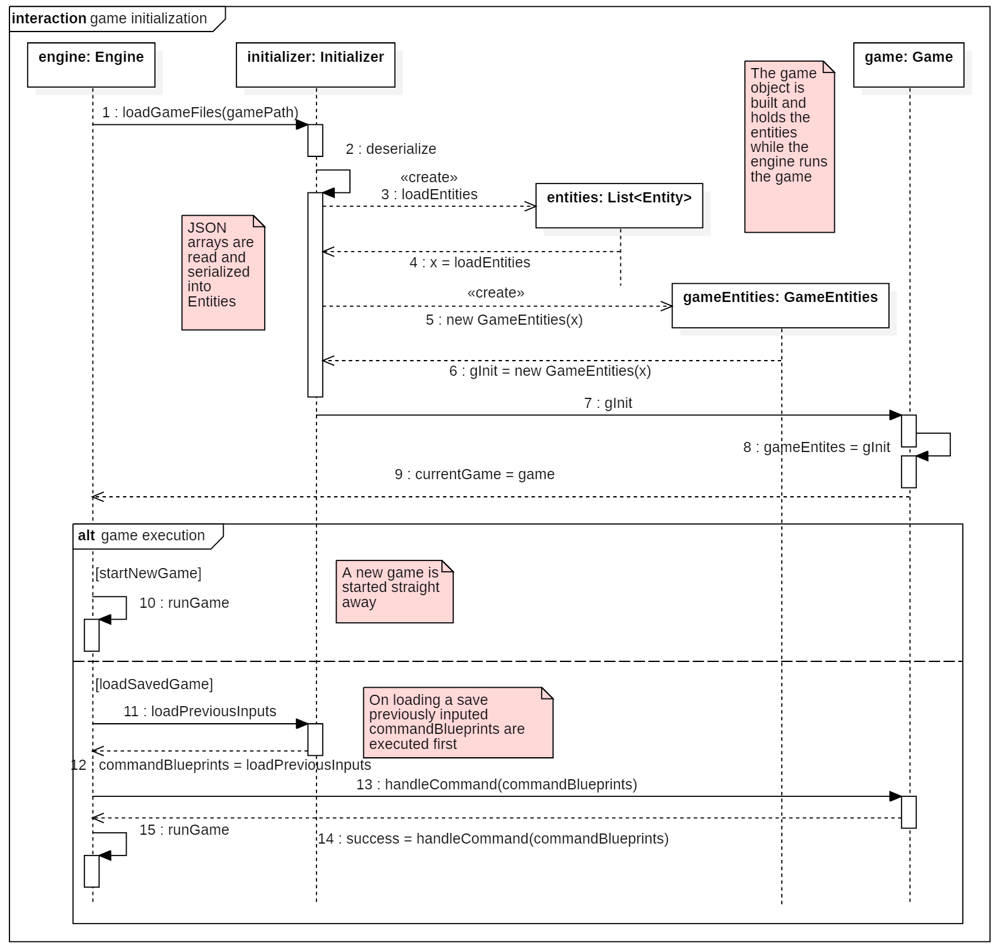
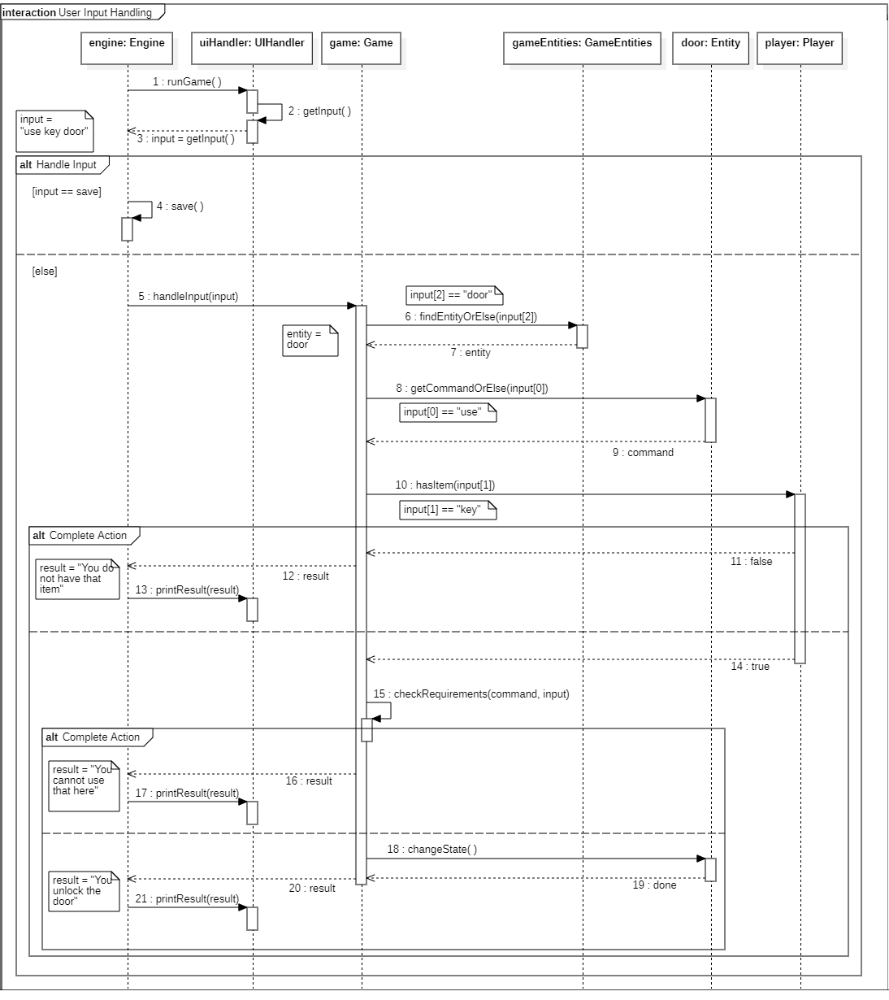

# Assignment 2

### Implemented features

The list of features that have been implemented can be found in the table below. A more profound description of these features can be found later in the document under the **Implementation** section.

| ID  | Short name  | Description  |
|---|---|---|
| F2  | Movements | The player can move between areas freely using the `move [direction / area]` command. No obstacles have been implemented yet. |
| F3  | Areas | Two areas are connected by means of an edge. Each edge is defined using a connection set entry comprising of a direction and the name of the connected area. The area's (unique) description is also displayed once the player enters that area. |

### Used modelling tool
[StarUML](http://staruml.io/)

## Class diagram									
Author(s): `Anthony Wilkes, Ajay Hitendra Mota`

**Engine**
The engine is the heart of the system and can be considered the (grand) parent of all the other components. It will contain the entry point of the entire project and acts as a bridge between the game itself, the UI, and the JSON handling code, whilst also controlling the state of the overall system and handling certain meta-commandBlueprints meant for the engine itself (e.g. saving the game).

Attributes
- *games: List\<Game\>* - Initially the player will be presented with a list of different games they are able to load and play, this attribute will hold the names of the different options.
- *currentGame: Game* - Once the player has selected a certain game to play, the game data will be loaded from the respective JSON files and a new Game object will be created. This attribute will hold a reference to this currently running game.

Operations
- *handleGameOver()* - When the player either wins or loses the game this function will handle reloading from a prior save, starting a new game, changing the engine state back to the initial menu, or quitting.
- *loadGameList()* - Gets the names of all available games that can be loaded and played. Available games will be folders of JSON game data files where the name of the folder will be the name given in the menu and presented to the player.
- *initializeGame(game: Game)* - Loads the game files selected by the player. Instructs the **Initializer** to load the appropriate JSON files then passes the required parameters to the **Game** constructor and sets *currentGame* to hold the reference to this new game. *initializeGame* will be called when the player selects an option from the initial menu.
- *quit()* - If a game is currently running, this function will prompt the user to save before exiting, otherwise will simply close the engine and exit.
- *startNewGame()* - Once the player has selected a game to play from the initial menu, they can start the game from the initial state without loading a prior save.
- *loadSavedGame()* - If the player wishes to load a prior save, this function will allow them to do so. Save game files hold a list of all prior successful actions (with meta-commandBlueprints stripped out - this includes things like "save", "load", and "quit"), and these actions are replayed to get the current game into the prior state.
- *saveGame()* - Saves the list of prior successful, non-meta-commandBlueprints to a file with the game data JSON files of the current game.
- *runGame()* - A loop that runs whilst the current game is not over. This loop will ask the UIHandler to block for user input, then determines if this input needs to be passed to the game or not (e.g. a "save" command is handled by the engine itself, and is not passed to the game). If required, the user input is passed to the game through the game's *handleCommand* function.
- *main()* - The entry point for the application.

Associations
- **_Initializer_** - Composite. The engine must contain an **Initializer** to handle loading games from JSON files. The **Initializer** should not exist outside of the **Engine**.
- **_Game_** - Composite. **Games** should not exist apart from an **Engine**, however an **Engine** is not required to have a current game initialized at all times.
- **_UIHandler_** - Composite. The **UIHandler** should not exist apart from the **Engine**.

**Initializer**

Attributes
- *parser: Gson* - The class for Google's JSON parsing library.

Operations
- *loadGameFiles: GameEntities* - Finds the JSON game data files associated with the given file path. When the player selects a game from the initial menu the name of this game will be sent to the **Initializer** and the **Initializer** will then open the appropriate folder containing the selected game's game data files. The data from these files will be used to construct a **GameEntities** object which will be sent back to the **Engine** so that it can construct an appropriate game.
- *loadEntities: Map\<String, Entity\>* - A sub-function that will load **Entity** objects from the appropriate JSON files into a map of name:entity pairs.
- *loadPreviousInputs: List\<String\>* - Opens and loads into memory the list of commands the player entered when playing previously. These commands will be sent to **Engine** which will replay these commands when loading a saved game.

Associations
- **_GameEntities_** - Shared. The **Initializer** will use JSON files to create game entity objects which will be stored in a **GameEntities** class. This class will be passed to a **Game** object on construction and will act as the base upon which the game is built.
- **_CommandFactory_** - Shared. Some entities described in the JSON files can optionally contain commands that describe how the player can interact with them. Commands will be described in the JSON as a name, e.g. "use" for "use key door", followed by a function name that related to a **Command** class such as "changeLocation" or "takeItem". This data will be sent to the **CommandFactory** which builds and returns the correct **Command** type which can then be placed inside the appropriate object (e.g. a door might contain a changeState **Command** that allows a use to type "use key door" to unlock the door).

**CommandFactory**

Operations
- *createCommand* - Take input from the **Initializer** that has stripped data from the JSON game data files and uses this to create the required **Command** object, preventing the **Initializer** class from having the determine the correct **Command** implementation itself.

Associations
- **_Command_** - Shared. The **CommandFactory** will create and return **Command** objects.

**Command**

Operations
- *apply(target: String): String* - **Command** objects will be used to check the validity of input instructions given by the user, to do this an object specified by the user will be queried for an appropriate **Command** object (e.g. "use key door" will query the "door" object to see if it contains a command called "use"). If the object contains a matching command then the parameter specified by the user will be passed to this **Command** object and if the parameter matches some internal specification (different implementations for different commands), then the instruction succeeds and a result is performed. The success or failure message will be returned as a String which will, eventually, be passed up the **Engine** object that can then send it to the **UIHandler** to print to the terminal.

Associations
- **_Entity_** - Shared. **Command** objects must know about the entities they relate to to allow them to change the attributes of those entities, e.g. a **ChangeState** **Command** would need to inform a related **Obstacle** object to change its state from active to inactive (for example, when unlocking a door).

**ChangeStat**

An implementation of the **Command** interface that acts to change stats associated with a game **Character**, e.g. picking up a sword may increase the player's strength, eating an apple may increase their health, fighting an NPC may reduce health.

**ChangeState**

An implementation of the **Command** interface that operates on **Obstacle** objects. When **Obstacles** are active, they prevent the movement of the player from one particular **Area** to another, when inactive they allow movement. The **ChangeState** **Command** allows **Items** to be used by the player to change an **Obstacle's** state from active to inactive and vice versa.

**ChangeLocation**

**ListContents**

An implementation of the **Command** interface that gets a list of **Item** names held by any **Entity** class that has an inventory. This is likely to be used frequently when listing the player's current inventory or when printing descriptions of the current **Area**.

**Describe**

An implementation of the **Command** interface that gets the String associated with the *describe* attribute in the **Entity** class. This will likely be used frequently as the player moves from **Area** to **Area**, when they look at **Items**, meets **NPCs** etc.

**TakeItem**

An implementation of the **Command** interface that allows a **Character** to add an **Item** in the current **Area** to their inventory.

**DropItem**

An implementation of the **Command** interface that allows a **Character** to remove an **Item** from their **Inventory** and to drop in the current **Area**.

**UIHandler**

Operations
- *displayGamesMenu(games: List\<String\>): void* - Will print the list of available games in a styled menu for the player to choose from.
- *displayMainMenu(): void* - The initial menu presented to the player, serves as a kind of splash screen for Cork.
- *displayGameSubMenu(game: String): void* - Shown once the player has selected the game they would like to play, presents the options to start a new game, load a game, or quit.
- *getInput(): String* - Blocks waiting on user input and passes the raw result back to the **Engine** to handle as needed.
- *clearScreen(): void* - Clears the screen to a blank state.
- *printResult(result: String): void* - Prints the String provided. This will be used frequently to provide the user feedback, for example a description will be printed when the player enters a new **Area**, the success of an action may cause some change in game state (e.g. unlocking a door will notify the player that the door is now unlocked), or the failure of an action to complete (e.g. the input "eat grue" might return a failure message like "You cannot do that", unless a *modder* user makes it possible).

**Game**

Attributes
- *playerWon: Bool* - When the game is over the player has either won the game or lost it, the game is won when the player is holding a specific item, or it may be lost when the player has died.
- *previousCommands: List\<String\>* - The **Game** class should keep track of all previously played moves so that, if the player wishes, they can save their game and reload it later. Loads will replay the list of saved commands, so keeping track of this properly is important. Note that since the **Engine** handles meta-level commands like *save* or *load*, these commands will never get sent to the **Game** object, and so they will never be added to the save game file - this should prevent problematic behaviour like encountering a *load* command during the loading of a save game file.

Operations
- *isGameOver(): Bool* - Returns whether or not the game is over.
- *getPreviousCommands(): List\<String\>* - Returns the list of previous inputs by the player, this will be used when 
- *handleCommand(input: String): String* - The **Engine** will send the **Game** class any relevant input it needs to deal with, this will mainly be input that deals with the interaction between **Entities** such as unlocking doors, interacting with **NPCs**, or moving between **Areas**.

Associations
- **_GameEntities_** - Shared. Since all player input will be in the form of Strings, the **Game** class will need a way to associate String names with specific game **Entities**. The **GameEntities** class will act like a sort of Dictionary to allow this, whilst also providing an interface for the **Game** to interact with **Entities** with.

**GameEntities**

Attributes
- *areas: Map\<String, Area\>* - Allows access of **Area** objects by their name.
- *obstacles: Map\<String, Obstacle\>* - Allows access of **Obstacle** objects by their name.
- *npcs: Map\<String, NPC\>* - Allows access of **NPC** objects by their name.
- *items: Map\<String, Item\>* - Allows access of **Item** objects by their name.
- *player: Player* - Holds a reference to the **Player** object.
- *emptyEntity: Entity* - Holds a reference to an unimportant, generic **Entity** to make carrying out the commands associated with user input more intuitive and less bound to error handling. For example, when an appropriate **Entity** cannot be found for an input (e.g. the user might type "talk merchant" when no merchant is in the current location), then the **Game** will be given this blank **Entity** that can be acted upon without changing anything in the game world, or requiring the **Game** object to handle the missing reference. Instead, commands attempted to be carried out on this empty **Entity** will return error messages like "you cannot do that" to let the player know they did something wrong, as part of an error handling system invisible to the **Game** class.
- *gameOverItem: Entity* - Holds a reference to the **Item** the player needs to be holding for them to win the game.

Operations
- *findEntityOrElse(name: String): Entity* - Returns a reference to the **Entity** object matching the given name, or a reference to a blank, generic **Entity** as described above.

Associations
- *Entity* - Shared. The **GameEntities** class organises, and provides an access point for, all the **Entities** in the game world.

**Entity**

Attributes
- *name: String* - All **Entities** should have a unique name that they can be referenced by.
- *description: String* - All **Entities** should have an accompanying description to allow interaction with the **Describe** **Command**.
- *active: Boolean* - Indicates whether the **Entity** object is active or not. Inactive objects should not be present in the game world, and this attribute makes it possible for objects to be destroyed (with a garbage collector - not currently planned or implemented - able to remove inactive objects from **GameEntities** collection).

**Area**

Attributes
- *inventory: Set\<String\>* - Holds the names of all **Items** in the current area. **Entities** do not hold references to other **Entities**, but instead all interaction happens through the **GameEntities** class, in a data-oriented manner.
- *npcs: Set\<String\>* - Holds the names of all **NPCs** that are in the given **Area**.
- *connections: Map\<String, String\>* - Holds the names of all possible directions for the given **Area**, mapped to the name of the respective **Area**. For example, the *garden* **Area** might connect to the *palace* **Area**, and so *garden's* *connections* Map might contain the key:value pairs: "north":"palace" and "palace":"palace", allowing the player to type either "move north" or "move palace" and get the desired result.
- *obstacles: Set\<String\>* - Holds the names of all **Obstacles** in the given **Area**, allowing their descriptions to be printed when the player enters a room.

Operations
- *connectsTo(name: String): Boolean* - Verifies whether or not the given **Area** connects to some other **Area**.
- *getConnection(name: String): String* - Converts the name of a direction to the name of an **Area**.

**Item**

Attributes
- *consumable: Boolean* - Indicates whether or not the **Item** should be destroyed on usage.

**Stat**

Attributes
- *value: Integer* - Holds the value of a given stat, e.g. the player may have *10* strength or *30* health.
- *name: String* - The name of the given stat, e.g. "health" or "strength".

**Character**

Attributes
- *inventory: Set\<String\>* - Holds the names of the **Items** held by the given **Character**.
- *stats: Set\<String, Stat\>* - Holds the **stats** applicable to the given **Character**

**NPC**

Attributes
- *isFriendly: Boolean* - Indicates whether interaction with the given **NPC** will initiate combat or conversation.

**Interactable**

Attributes
- *emptyCommand: Command* - Provides a generic, blank **Command** object that simplifies error handling when the **Game** class is trying to carry out actions.
- *findCommandOrElse(name: String): Command* - Returns the **Command** associated with the given name, or else the *emptyCommand* described above.

**Player**

Attributes
- *currentLocation: String* - Indicates the name of the **Area** the player is currently in.
- *commands: Set\<Command\>* - Indicates which **Command** objects relate to the player.

**Obstacle**

Attributes
- *state: Boolean* - Indicates whether or not the given **Obstacle** is currently active and thus preventing movement to a certain location.
- *requiredObject: String* - Holds the name of the **Item** that can change the state of the given **Obstacle**, e.g. a "key" is required by a door, or a "lantern" by darkness.
- *commands: Set\<Command\>* - Holds the list of **Commands** that relate to the **Obstacle**.
- *currentLocation: String* - The name of the location the **Obstacle** is found in.
- *blocks: String* - The name of the **Area** that the **Obstacle** prevents movement into.

## Object diagrams								
Author(s): `Anthony Wilkes, Ajay Hitendra Mota`

The figure representing the UML object diagram is as follows :-

In the above diagram the system is in a state wherein the game has been loaded successfully and the gamer just inputed the command `eat apple` into the system. The description of the various objects and the states of their variables are as follows :-
- **engine**: The engine object is the main controlling object of the system itself. It is also responsible for running a game. The selected game is stored as a variable called `currentGame` and the list of games found on the system are saved as a list of strings called `games`. The engine builds the `currentGame` with the help of the `Initializer` class.
- **game**: The game object holds the state of the game that has been initialized. It holds the `playerWon` boolean variable that is trigerred when the player holds a `gameOverItem` in his/her inventory. This is currently set to false as the game has just started. The second variable is the `previousCommands`. This is a list of string commands that the gamer has typed in earlier. In our current case it holds the string "eat apple" which the player inputed into the console. The last variable is an object of the type `GameEntities`. This is the main dictionary object holding all the game objects and it is initialized using the `Initializer` which will be described in the next point.
- **Initializer**: The Initializer is a static class that reads the JSON files for the game and returns the correct `GameEntities` object called `gInit` after deserializing the files. It is used as a one-off class during initialization and does not hold any valuable data.
- **ge**: This is the main dictionary object for the entire game and is used as a storage for the various game objects. There can only be one object of the type `GameEntities` and it is persistent in memory till the system is not exited. It also holds the states of the various objects. It stores these in the form of maps of all the entities supported by the engine such as the `areas, obstacles, npcs and items`. It also holds the main `player` object, the `emptyEntity` and the `gameOverItem`. The maps are shown with a 1-to-many relation in the UML and the player, emptyEntity and gameOverItem as a 1-to-1 relation.
- **area**: A game needs to have atleast one area and this is where the player is spawned. In our case the area in view is the forest. It currently has a diamond in it, a troll NPC and is connected to the castle which lies to it's north. This connection is however blocked by an obstacle called the door.
- **npc**: A game can have zero or multiple NPCs. In our case we are focusing on an NPC called the troll who does not have any items in his inventory, is friendly to the player and is active in the game. This means that the user can interact with him.
- **item**: A game can have zero or more items. In our case we will focus on the item apple as this is the subject of the user's previous command. The item's name is apple, it is consumable meaning that it can only be used once and it's active flag is set to false. As eating an apple is only possible once, it is considered to be a consumable. This is different from an object such as a key that does not get consumed. As the user has already eaten the apple, the active flag has been set to false to show that the object is not a part of the gameplay anymore.
- **itemStat**: The apple holds a `Stat` object called health that increases the value of its consumer by `10` as defined in the object. This change can be observed in the player.
- **player**: This is the main entity responsible for interacting with the game world and other entities. It holds a `playerStat` called health which has been increased from `100 to 110` because of eating the apple. The player is in the area forest which is stored as a String variable called `currentLocation`. He holds an apple in his inventory and has the command `eat` attached to him.
- **eat**: Our system allows modders to design their own custom commands into the game they are modding by editing the JSON files appropriately. In our case one such custom command is the `eat` command that is an object of the type `ChangeStat`. This command object accepts the apple as a parameter and applies the stat health of the apple to the player' stat with the matching name on activation using an `apply()` function. This beahviour is abstracted away in this diagram. 
- **obstacle**: A game can have zero or more obstacles. In our case we have an obstacle called the door that exists inside the forest and blocks the user's path to the castle. The door just like the player has a command object called `use` of the type `ChangeState`. This checks for a `requiredObject` called key when the command is executed by the player. On a sucess the state of the obstacle is set to true and the area is no longer blocked.
- **emptyEntity**: This is the placeholder or the default entity that the `ge` should contain. It is used whenever a find entity command fails. This helps in supressing errors and throwing exceptions.
- **gameOverItem**: As mentioned earlier this is the main item in the game that when acquired by the player changes the flag `playerWon` and causes to game to finish. In our case the object is called a diamond and as previously mentioned it is stored in the forest's inventory. 

This sums up the objects during execution of a game. Some objects such as the deserializers and the UI have been abstracted away as they do not hold variables and states. 

## State machine diagrams									
Author(s): `Anthony Wilkes, Ajay Hitendra Mota`

In this section we will describe two components of the system that hold different states. There are the **Engine** class and the **UIHandler** class.

### Engine

The **Engine** class will be the main, top-level control point for the system as a whole. On system start the **Engine** will load the list of available games that the user can play so as to present them in a menu. This list will be determined by the **Initializer** as it is the **Initializer** that should be responsible for interactions with game files. If the **Initializer** fails at any point during this process, it should return a reason why and this error response should be printed to the console before the system exits.

Once the game list has been loaded the user will be shown the main menu which waits either for the user to exit or for a game to be selected. If a game is selected, the **Engine** will notify the **Initializer** which game files to load, and will construct an associated **Game** class (this process is not shown here as it does not relate to the **Engine's** state or the transitions between them). Once the **Game** class is ready, the **Engine** will display the game's menu, which presents the user with the options: *start new game*, *load game*, and *quit*.

If the user chooses to start a new game, the **Engine** will enter into the *game running* state, however if the user chooses to load a game, the **Engine** will notify the **Initializer** that it requires the list of previously played moves (if any), and will start the game without entering the *game running* state. This allows the **Engine** to feed previous player input into the game without requiring the user to type anything in. Since the game world is deterministic, this allows games to be loaded by replaying every action the player had previously typed and end up in the same state as when they saved the game originally.

Once this load process has completed (or if the user chose to start a new game), the **Engine** enters the *Game Running* state, where it will act as a bridge between the **UIHandler** and the **Game** class. Commands typed by the user will first be sent to the **Engine** which will only send them to the **Game** class if appropriate. For example, if the player chooses to save their game, this should be handled by the **Engine** as it does not relate to knowledge the **Game** should have - the **Game** knows about **NPCs** and **Areas**, but not about files and folders.

If the user chooses to quit the game whilst in the *Game Running* state, then the **Engine** should intercept this request and prompt the user to save their game. If the user chooses to do so, this is done just before exiting, otherwise the **Engine** just exits directly.

Finally, if the game ends in the *Game Running* loop (i.e. the player obtains the item which ends the game, or the player dies), then the **Engine** will handle this appropriately - printing some message to let the user know what happened, and then returning back to the main menu to allow the user to choose to play a new game or exit.

### UIHandler
The state machine diagram for the UIHandler is as follows :-

The UI as mentioned earlier will make use of a terminal window that is called using the native terminal application provided by the Operating System and otherwise open a window using the *javax.swing* package. This functionality of opening an application window will be provided by the *Text-IO* package.

The general states can be briefly explained prior to diving into their details as follows :-
- On running the JAR file an application window is opened up as explained earlier
- The UI then changes the state to a **Game Menu Display** that allows to user to select the game or quit the application
- On selecting the *Select Game* option, a list of different games will be displayed to the user that are available on disk.
- On selecting a particular game the user could then start a new game or load a previously saved game or even quit the game.
- If the user decides to start a new game or loads a game, the UI enters a new state that can be called the **In Game Display**.
- Here the menu is cleared from the terminal and the appropriate game files are loaded in the background.
- The player's starting location is displayed and the UI waits for user input.
- The success or failure message of each command is displayed to the user and the state returns to waiting for user input.
- The application keeps alternating between the two internal states till the user does not enter the `quit` command.
- On `quit` the application window is closed and the application exits. 

The UIHandler will exist in two major states with multiple internal sub-states. The description of the major states are as follows:-
- Game Menu Display: The game menu is one of the two primary states of the UI provided by our engine. It holds the different sub-states that allows the user to select a game from a list of games found on the system. A depiction of the possible options and the menu can be observed from the notes attached to the state diagram. The application window is loaded and stays open persistently until the application is not closed. It is possible to exit the workflow and enter the final exit state if a user wishes to in any of the internal sub-states. Thus allowing for a better user experience. There are three internal substates which can be described as follows :-
    - Main Menu Display: This is a state of the UIHandler that is loaded inside the Game Menu Display and holds the state for the main menu of the engine. There are two available options *Select Game* or *Quit*. The state persistently waits for user input and only changes once the user presses an arrow key. As mentioned earlier we will be making use of the Text-IO library. This library allows for input of arrow keys and the user's choice will be registered on the menu as a form of an arrow key pointing to a selection. On keyboard return or the enter key press the selection would be registered and the game will continue to either the next state or quit. This state is to help the user get familiarized with the UI as the menu's that follow work similarly. No internal processing on the side of the engine is done here in the background.
    - Games List Display: This state just like the previous state displays a list of games found on disk and provides the list in the form of a menu if the user's previous selection was *Select Game*. All games exist in a designated folder and the name of the folder containing the game files is used as a title for the menu list item. No other processing is done here. The user can make one choice from possibly several games or quit the engine just like the previous display state. This menu shows the core functioning of our engine to the user and also allows the user to see that our engine supports various scenarios or in this games.
    - Game Menu Display: This is the internal menu display that is opened once the user picks a game he/she wants to play using the keyboard. This loads a screen similar to the main menu but here three options are available. The user can either start a new game, load a saved game or quit the engine. If the user goes with either option 1 or option 2, the state is changed to the next main state and the menu display would be cleared. There would be no more option to use the arrow keys anymore and quitting would only be possible using the `quit` command. So as a menu display this is the last state a user could quit the engine before loading the in game display.
- In Game Display: During the transition from the Game Menu Display to this state certain internal states are initialized and executed that are not visible to the user. If the user selects the *Start New Game* option then a state called 'Game Files Loaded' is triggered that reads the JSON files of the game selected and builds the game. On the other hand, if the user selects the *Load Saved Game* option then a state called 'Save Files Loaded' is trigerred. The behaviour of both states is very similar with the only difference being, loading a saved game leads to replaying of previously inputed actions without notifying the user by reading a text based saved file. In the new game option this does not happen. On completion of the loading and execution, the UIHandler enters the game. Here the user's starting location in the game and the inventory is displayed. The UI persists in this stage till the user does the quit the game manually by typing the `quit` command or by closing the application window using the default options of the host's window manager. The UI continues alternates between two sub-states where it continuously waits for a user input, displays the results of the input immediately and waits for user input thus repeating the cycle persistently.

## Sequence diagrams									
Author(s): `Anthony Wilkes, Ajay Hitendra Mota`

In this section we will describe two crucial parts of the system during its functioning. The first will be a sequence disgram depicting the initialization of a game and the second will be a diagram depicting the game while executing an example command. Both diagrams aim to show the functionality of the engine we are designing and also to document the timeline of events and function calls to make it easier to implement.

### Game Initialization Sequence

The UML diagram for the interaction is as follows :-

The game initialization sequence is divided into two main parts. The upper half of the diagram shows the initialization of the game with the correct objects, their lifelines, their types and the right functions/values used as messages. The lower half shows the two alternate scenarios in prescriptive detail till the point in time that the game just starts its execution. The description of the two main phases is as follows :-
- Pre-Initialization: The engine being the main controller of the game invokes the initializer object by passing the game path of the selected user's choice from the UIHandler. This is abstracted away in this sequence diagram. The main initialization occurs from this step as follows :-
    - The `initializer` object is invoked and the initializer starts reading the JSON files available in the game path variable provided to it by means of the `loadGameFiles()` function.
    - The initializer *deserializes* the JSONs internally and maps them to the respective Entity types and loads a list of entities for each type. These are the Items, Player, Obstacles, Areas and NPCs.
    - These entities that are returned by means of a `loadEntities()` function are then passed as a parameter to construct the gameEntities object.
    - The `gameEntities` object being the main dictionary of the architecture is then passed into the game object and saved there to be used persistently.
    - Once this sequence is completed successfully the final `game` object is returned back to the engine that is then stored as the `currentGame`.

- Post-Initialization: In this state most of the heavy lifting is done by the engine itself as it is responsible for running the game and handling loading of saved files. There are two alternative paths that the sequence flow can take. There are as follows :-
    - startNewGame: This path is relatively simple. If the user had previously selected the 'Start New Game' option in the UIHandler then the program enters this workflow wherein the engine starts executing the game by calling the `runGame()` function. This is function has an internal loop and persists until the user does not quit the application manually.
    - loadSavedGame: This workflow is activated if the user decides to load a saved game during game execution or in this case when the user previously selected the option 'Load Saved Game'. The subsequence for this alternate workflow is as follows :-
        - The engine calls the initializer object again to read the saved game file. This is saved as a *.txt* files holding all the user's previous commands. The invoking is done using the `loadPreviousInputs()` function.
        - The initializer after parsing the relevant saved file returns the list of commands as strings which are then saved as a parameter `commands` in the engine. This is stored to allow for saving and overwriting previous data without losing previous inputs and provides a valid starting point always.
        - The commands are then sent to the `handleCommand()` function of the game object one after the other to execute and get the game to the user's last known state before saving.
        - On success the game returns a message and the execution of the game is continued normally using the `runGame()` function. This last step is almost identical to the 'startNewGame' step mentioned above.

### User Input Handling

The sequence diagram above follows the processes that occur after the user has typed in the command "use key door" during gameplay. To enable input to be captured the **Engine** must be inside the *runGame* loop, where it calls the *getInput* function inside the **UIHandler** which blocks waiting for the user to type something in. Once input has been received, the **UIHandler** returns the String input to the **Engine**. At this point control flow splits up based on what value the input holds. If the input is a meta-command (e.g. "save", "load", or "quit"), then the **Engine** deals with this command directly before continuing with the *runGame* loop's next iteration (note that, since this diagram is looking to describing the **Engine's** interaction with the game-world, only the alternate process for "save" is shown as, at this level of detail, the other meta-command functions would be identical).

If the user has typed some input that is relevant to the game-world itself (or, conversely, has typed input that is not relevant for the **Engine**) then the **Engine** will pass this input on to the **Game** class through the *handleCommand* function. The **Game** class is then responsible for finding the relevant game entities and commands and executing the action the player has requested, if possible.

First, the **Game** class will try and find the object that owns the specified command. In the case of all commands, this will be the final name given, so for "use key door", the **Game** will search for an entity called "door" by asking the **GameEntities** class for it. The first path explored will assume such an **Entity** does exist, and then cover the result of no such **Entity** existing.

Under the assumption that a relevant **Entity** has been found, the **Game** class then queries this class to see if it has a command bound to the given name - the name of the command will be the first word in the player's input. In the case of "use key door" the **Game** will look for a command with the name "use".

Assuming such a command exists, the *door* object returns it and the **Game** class must now verify that the player is able to use the object they have referred to. In this case the **Player** object's inventory is queried for an **Item** with the name "key" - if the **Item** does not exist then the **Game** can terminate *handleCommand* early, returning with a message that informs the player what has happened, such as "You cannot use that item", allowing them to try something else.

If the **Player** object is holding the specified **Item**, however, then the **Game** can call the *apply* function on the relevant **Command** object it has a reference to with the given argument being the **Item** specified in the input - in this case "key". Once the **Command's** *apply* function has completed it will return a String with an explanation of what happened (e.g. if they key unlocks the door, then *apply* might return "The door unlocks", whilst if it was the wrong key it could return "You try the key in the lock, but it doesn't fit"). This result is then returned from the *handleCommand* function and the **Engine** routes the message through to the **UIHandler** which then prints it to the player.

The above explanation largely assumes that the given input leads to a successful command, however it is also possible that the player writes input that doesn't work, for example they might make spelling mistakes like "youse keey doro". In this instance, the system has been designed so that errors in the user input do not need to be handled explicitly, allowing the code written inside of **Game** to be free of exceptions and other error handling methods.

At the first stage of command completion, it's possible for the target **Entity** to not exist - in this case, there is not **Entity** called "doro". Instead of returning a null value that would require explicit checking, the **GameEntities** object returns a dummy **Entity** that has no effect on the game world, but can still be interacted with in an expected manner.

Next, it is possible that the command specified doesn't exist - in this case "youse" will not be found in the specified **Entity**. Note that if the player had spelled "door" correctly, the *door* object would return a dummy **Command** in the same way that the dummy **Entity** was returned previously (the dummy **Entity** will always return a dummy **Command**). This dummy **Command** can be used with the *apply* function just like any other, however the result returned will always signify that something went wrong (but no other action will be taken).

Through this process it should be clear to see that the results the player can receive will be something like the following:

- The player tried something successfully, and gets a message like "The door unlocks".
- The player misspelled or used the wrong target entity's name, upon which a dummy **Entity** provides a dummy **Command** that returns something like "You cannot see a doro here".
- The player misspelled or used the wrong name for the command, meaning a real **Entity** returns a dummy **Command** which returns something like "You cannot do that".
- The player used the wrong item name, meaning a real **Entity** returns a real **Command** that returns something like "You cannot use the apple to unlock the door" (assuming the apple is in their inventory)
- The player misspelled the item name (or tried to use an item they are not holding) meaning the *handleCommand* exits early with a message like "You do not have a keye on you".

## Implementation									
Author(s): `Jim Cuijpers, Luca Taglialatela and Hongyu He`

### UML to Implementation Strategy

Since the design of **Cork** was based around user customizability, it was imperative that the system was planned out in detail before any implementation happened - writing too much code before it was clear how the system would work would be very likely to lead to dead ends and a lot of refactoring. Likewise, it was important that the system was planned in detail so that confidence the system would actually work was high. Since **Cork** is intended to allow *modders* as a type of user, it meant that the design of the system had to reflect the creativity that the users might want to express. This required a highly prescriptive approach to planning to ensure all eventualities had been covered.

The system model was designed in stages starting from high-level, descriptive class diagrams which slowly evolved as they increased in detail towards the final, prescriptive design. Once the final design was reached the sequence diagrams were developed to ensure that the most important sequences in the system would work as intended (creating the game objects from the JSON files and handling user input interaction with the game world).

The team was then split in two where three members wrote the code for the game whilst following the UML model, and the remaining two members finished the remaining UML diagrams and updated the UML when any issues were encountered (both from the team that worked on the code and during writing the report e.g. a function that was written into the UML originally might no longer have been relevant, or an overly prescriptive function was added that could be removed as it was not relevant to the model but only the code).

### Key Solutions for Implementation

While a game such as Cork may look simple at first glance, a lot is going on in the background. There have been lots of details which
needed special attention and thought before their implementation, because a wrong approach could be very expensive later on.

- Initialization: This was one of the most challenging modules we had to work on. Our idea was to make use of JSON files and map them to corresponding Java classes. This proved to be a bit more work than expected. We had to build deserializers that mapped perfectly to the objects. For this we first built the JSON files for the game and the `Entity` classes corresponding to these JSON files in Java by following the UML. We then built the deserializers using the `JsonDeserializer` provided by Google's `gson` library to map the JSON to the actual classes. Once each entity correctly mapped to the JSON, it was a matter of building the dictionary-style class called `GameEntities`, which stored all the different `Entity` objects in `HashMaps`. This initialization was abstracted away into a class called `Initializer` which just built the `GameEntities` object and we used this object for the entire duration of game execution.

- Areas: Initially, we came up with the idea of connecting our areas through the use of a graph. In this setting the areas would
form the nodes of the graph, with the edges functioning as connections between the areas. We discovered, however, that this was not
as good of an idea as we had thought at first. Representing the areas in a graph would first of all have meant that we would lose out
on the simplicity of just having four different directions (north, east, south and west) to work with. Additionally, this implementation
would have also caused a conflict with the initialization of our game as it would require building a graph and then utilizing it correctly with our dictionary-based structure. This would mean maintaining two different versions of the same data in different formats while providing no additional value. Hence with these ideas in mind, we implemented the feature `F3` by designing a connection set in JSON, which then mapped to a Java HashMap, which held an area and its direction. (for e.g. an area named forest having a connection to a castle in the northern direction is represented as `{"north": "castle", "castle": "castle"}`). This representation allowed us to access a given area using its direction or its name as both are held as keys pointing to the same area. 

- Commands: We wanted the modders to build custom commands and name them as they liked. This is mentioned as a feature `F1B` in the `assignment1.md` file. To do this we had to first deserialize each command mentioned in the JSON to a `commandBlueprint` that held the name and the type of command. This `commandBlueprint` was useless to us in-game in its original form as it was just pure data. To convert this into usable command objects we built a `populateCommands()` function into the `Initializer` that took a completed `GameEntities` object as a parameter and built the corresponding command objects using the `commandBlueprints` for the player and each obstacle. This allowed us to have support multiple commands with the same functionality (for e.g. `go` and `move` both implement feature `F2`)  

- Engine and UI: The **Engine** was designed to be the heart of the **Cork** game system, and so it acts as the main point of control for the system's state (modelled in the state machine diagrams above). The **UIHandler** had a state that was closely tied into the **Engine's** state - since the **UIHandler's** responsibility was only about presenting output and reading input, it made sense to allow the state of the **Engine** to control the state of the UI (thus encapsulating all system state into one location). In this way the descriptions given in the UML were adhered to - the **Engine** follows a specific process when moving from menu to menu, and the **UIHandler** can only show the menus it is asked to when it is asked to.

### Main Execution

Our current main Java class is Engine. As shown in our UML diagram it functions as intersection between all our other classes.
Upon running Engine, the UI is initialised and presented to the user. They can then choose how to proceed next by selecting
one of the games located in their /games folder.

### Jar Location

Maximum number of words for this section: 2000

## References

References, if needed.
