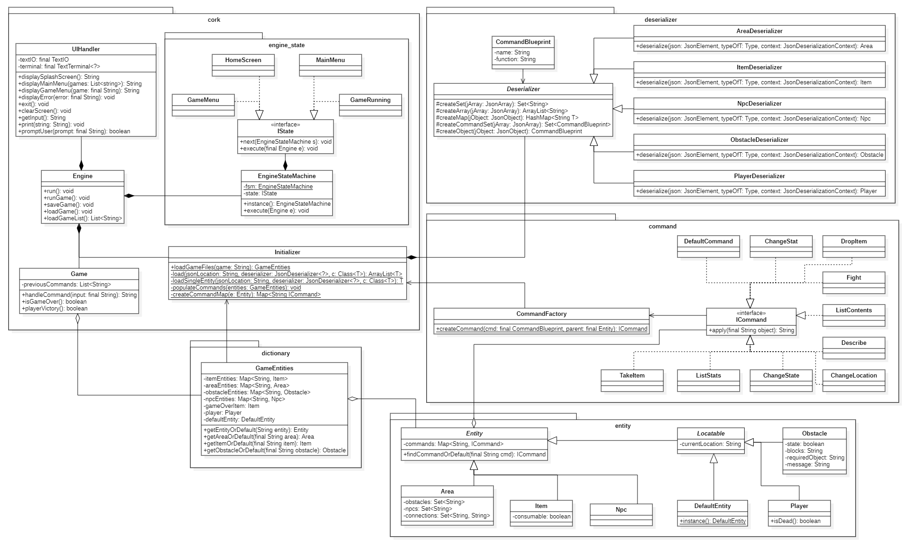

# Assignment 3

Maximum number of words for this document: 18000

**IMPORTANT**: In this assignment you will fully model and impement your system. The idea is that you improve your UML models and Java implementation by (i) applying (a subset of) the studied design patterns and (ii) adding any relevant implementation-specific details (e.g., classes with “technical purposes” which are not part of the domain of the system). The goal here is to improve the system in terms of maintainability, readability, evolvability, etc.    

**Format**: establish formatting conventions when describing your models in this document. For example, you style the name of each class in bold, whereas the attributes, operations, and associations as underlined text, objects are in italic, etc.

### Summary of changes of Assignment 2
Author(s): `Anthony Wilkes`

- *"Object diagrams should not have arrows"*, Ferch42 (TA)  
   **These arrows were removed form the UML.**

- *"Wait for user input does not correspond to an event, so the wait for input transition is redundant. It is an activity the object performs"*, Ferch42 (TA)  
   **Wait for input transitions were removed from the UML.**

- *"'p' 's' and 'ge' are vague names."*, anhphi99 (reviewer)  
    **Short variable names were confined to very short scopes only, and limited to have only one single letter variable in scope at a time.**

- *"Dictionary package holds one class, which creates GameEntities, -and- has the functionality 'findEntityOrElse'. (I don't know if this is typical naming that I'm not familiar with yet, but I'd say its unclear what happens when 'else'.)"*, Ece-Doganer (reviewer)  
   - Made null object names consistent (team choice, linked to the above)  
   
   **All getXOrElse functions were all renamed to getXOrDefault, and all null object classes were renamed to Default\<ClassName\> to make the intention clearer.**

- *"EmptyEntity and GameOverItem are missing in class diagram and description. The save and load features, including deserialiser package contents, is missing in class diagram and description as well"*, Ece-Doganer (reviewer)  
   **These classes and features were added where relevant.**

### Application of design patterns
Author(s): `Anthony Wilkes`

`Figure representing the UML class diagram in which all the applied design patterns are highlighted graphically (for example with a red rectangle/circle with a reference to the ID of the applied design pattern`

For each application of any design pattern you have to provide a table conforming to the template below.

| ID  | DP1 |
|---|---|
| **Design pattern**  | Name of the applied pattern |
| **Problem**  | A paragraph describing the problem you want to solve |
| **Solution**  | A paragraph describing why with the application of the design pattern you solve the identified problem |
| **Intended use**  | A paragraph describing how you intend to use at run-time the objects involved in the applied design patterns (you can refer to small sequence diagrams here if you want to detail how the involved parties interact at run-time |
| **Constraints**  | Any additional constraints that the application of the design pattern is imposing, if any |
| **Additional remarks**  | Optional, only if needed |

| ID  | DP1 |
|---|---|
| **Design pattern**  | State Machine |
| **Problem**  | The Engine class needed to control the state of the system as a whole, with particular actions required in each state. At the end of assignment 2, the code inside the Engine class was beginning to show signs that it was unmaintainable (switch statement to change state), and lacked robustness (state could technically be changed to anything from anywhere). |
| **Solution**  | Application of the pattern moved the responsibility for changing state into separate classes - this allowed the state changing code in Engine to be localised to a single point, and ensured that more states could be easily added in the future. |
| **Intended use**  | The Engine object now holds a reference to the EngineStateMachine object which holds a reference to the current state object. When Engine is ready it asks the state machine is execute the current state, which asks the current state object to call the appropriate function in Engine, after which it changes to the next state. |
| **Constraints**  | Since the state classes now call functions in Engine, the increase in robustness has lead to an increase in the cognitive load required to understand the Engine class. However, the engine_state package is very small, and almost every class acts identically, so this increase should only be minor. |
| **Additional remarks**  | None. |

| ID  | DP2 |
|---|---|
| **Design pattern**  | Singleton |
| **Problem**  | To maintain consistent state, the EngineStateMachine was made into a singleton. If this were not the case, the Engine class could end up with multiple states in different stages doing different things. |
| **Solution**  | Turning the EngineStateMachine into a singleton means that, if someone tries to make a new EngineStateMachine object in the Engine, they will instead end up with multiple references to the same object. This means that there will be one, and only one, state for the Engine at all times. |
| **Intended use**  | A single instance of the EngineStateMachine is made at initialisation, with the creation of more being prevented through a private constructor. Any class wanting to access this machine must do so through a static method that returns a reference to this single object. |
| **Constraints**  | A singleton reduces the re-usability of the code as it makes it impossible to use this class in multiple scenarios. However, the EngineStateMachine is already very specific to the Engine class, and there is no other part of the system that requires a similar state machine, so this is an acceptable cost. |
| **Additional remarks**  | None. |

| ID  | DP3 |
|---|---|
| **Design pattern**  | Null Object |
| **Problem**  | Since Strings are an integral part of the project (the user will be typing instructions), it was immensely important to handle errors efficiently. Since the user is part of a tight feedback loop, it was considered fine for the system to fail if the user made a mistake, and to then immediately ask for a correction. |
| **Solution**  | When searching for an object with a name matching the user's input, if the object does not exist, a null object can be returned instead. This null object can be operated upon without any special cases needing to be handled, simplifying the code. |
| **Intended use**  | Null objects (DefaultCommand and DefaultEntity) can be returned from any findXOrDefault method in the GameEntities class. These objects implement all expected functionality, but instead of printing some successful result, they will return an indication of what went wrong, thus making error handling an inherent part of the system's operation. |
| **Constraints**  | The cognitive load to use GameEntities is increased, however the resulting code is simpler and can be understood without requiring to understand this functionality. |
| **Additional remarks**  | None. |

| ID  | DP4 |
|---|---|
| **Design pattern**  | Singleton |
| **Problem**  | The DefaultEntity class is a null object which causes no side-effects when interacted with, creating multiple would be a waste of resources. |
| **Solution**  | The DefaultEntity was made into a singleton so that any reference to it would interact with the same object instead of creating a new one. |
| **Intended use**  | Whenever a DefaultEntity is required (e.g. GameEntities cannot find an entity with the given name), a reference to the singleton is returned instead. |
| **Constraints**  | DefaultEntity can no longer contain any unique state, however, since this would violate the principle of a null object, this should cause no issues. |
| **Additional remarks**  | None. |

Maximum number of words for this section: 2000

## Class diagram									
Author(s): `Anthony Wilkes`

#### Engine

#### UIHandler

#### EngineStateMachine

#### IState

#### HomeScreen

#### MainMenu

#### GameMenu

#### GameRunning

#### Game

#### GameEntities

#### Entity

#### Area

#### Item

#### Npc

#### Locatable

#### Obstacle

#### Player

#### DefaultEntity

#### Initializer

#### Deserializer

#### CommandBlueprint

#### AreaDeserializer

#### ItemDeserializer

#### NpcDeserializer

#### ObstacleDeserializer

#### PlayerDeserializer

#### CommandFactory

#### ICommand

#### TakeItem

#### ListStats

#### ChangeState

#### ChangeLocation

#### Describe

#### ListContents

#### Fight

#### DropItem

#### ChangeStat

#### DefaultCommand

For each class (and data type) in the class diagram you have to provide a paragraph providing the following information:
- Brief description about what it represents
- Brief description of the meaning of each attribute
- Brief description of the meaning of each operation
- Brief description of the meaning of each association involving it (each association can be described only once in this deliverable)

Also, you can briefly discuss fragments of previous versions of the class diagram (with figures) in order to show how you evolved from initial versions of the class diagram to the final one.

In this document you have to adhere to the following formatting conventions:
- the name of each **class** is in bold
- the *attributes*, *operations*, *associations*, and *objects* are in italic.

Maximum number of words for this section: 4000

## Object diagrams								
Author(s): `name of the team member(s) responsible for this section`

This chapter contains the description of a "snapshot" of the status of your system during its execution. 
This chapter is composed of a UML object diagram of your system, together with a textual description of its key elements.

`Figure representing the UML class diagram`
  
`Textual description`

Maximum number of words for this section: 1000

## State machine diagrams									
Author(s): `name of the team member(s) responsible for this section`

This chapter contains the specification of at least 2 UML state machines of your system, together with a textual description of all their elements. Also, remember that classes the describe only data structures (e.g., Coordinate, Position) do not need to have an associated state machine since they can be seen as simple "data containers" without behaviour (they have only stateless objects).

For each state machine you have to provide:
- the name of the class for which you are representing the internal behavior;
- a figure representing the part of state machine;
- a textual description of all its states, transitions, activities, etc. in a narrative manner (you do not need to structure your description into tables in this case). We expect 3-4 lines of text for describing trivial or very simple state machines (e.g., those with one to three states), whereas you will provide longer descriptions (e.g., ~500 words) when describing more complex state machines.

The goal of your state machine diagrams is both descriptive and prescriptive, so put the needed level of detail here, finding the right trade-off between understandability of the models and their precision.

Maximum number of words for this section: 4000

## Sequence diagrams									
Author(s): `name of the team member(s) responsible for this section`

This chapter contains the specification of at least 2 UML sequence diagrams of your system, together with a textual description of all its elements. Here you have to focus on specific situations you want to describe. For example, you can describe the interaction of player when performing a key part of the videogame, during a typical execution scenario, in a special case that may happen (e.g., an error situation), when finalizing a fantasy soccer game, etc.

For each sequence diagram you have to provide:
- a title representing the specific situation you want to describe;
- a figure representing the sequence diagram;
- a textual description of all its elements in a narrative manner (you do not need to structure your description into tables in this case). We expect a detailed description of all the interaction partners, their exchanged messages, and the fragments of interaction where they are involved. For each sequence diagram we expect a description of about 300-500 words.

The goal of your sequence diagrams is both descriptive and prescriptive, so put the needed level of detail here, finding the right trade-off between understandability of the models and their precision.

Maximum number of words for this section: 4000

## Implementation									
Author(s): `name of the team member(s) responsible for this section`

In this chapter you will describe the following aspects of your project:
- the strategy that you followed when moving from the UML models to the implementation code;
- the key solutions that you applied when implementing your system (for example, how you implemented the syntax highlighting feature of your code snippet manager, how you manage fantasy soccer matches, etc.);
- the location of the main Java class needed for executing your system in your source code;
- the location of the Jar file for directly executing your system;
- the 30-seconds video showing the execution of your system (you can embed the video directly in your md file on GitHub).

IMPORTANT: remember that your implementation must be consistent with your UML models. Also, your implementation must run without the need from any other external software or tool. Failing to meet this requirement means 0 points for the implementation part of your project.

Maximum number of words for this section: 2000

## References

References, if needed.
