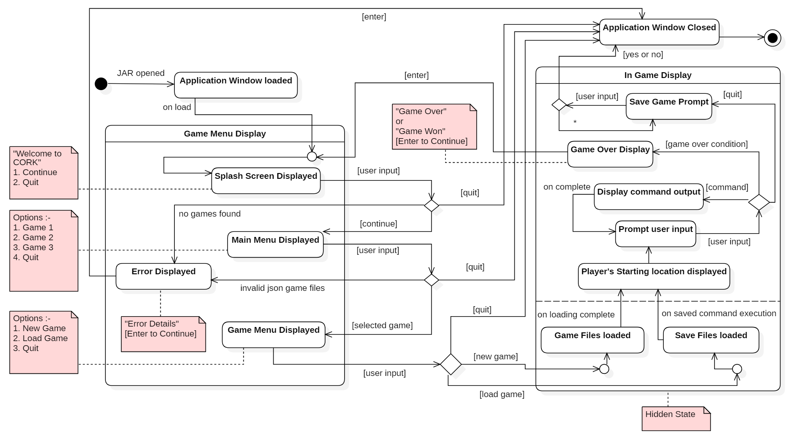

# Assignment 3

### Summary of changes of Assignment 2
Author(s): `Anthony Wilkes`

- *"Object diagrams should not have arrows"*, Ferch42 (TA)  
   **These arrows were removed form the UML.**

- *"Wait for user input does not correspond to an event, so the wait for input transition is redundant. It is an activity the object performs"*, Ferch42 (TA)  
   **Wait for input transitions were removed from the UML.**

- *"'p' 's' and 'ge' are vague names."*, anhphi99 (reviewer)  
    **Short variable names were confined to very short scopes only, and limited to have only one single letter variable in scope at a time.**

- *"Dictionary package holds one class, which creates GameEntities, -and- has the functionality 'findEntityOrElse'. (I don't know if this is typical naming that I'm not familiar with yet, but I'd say its unclear what happens when 'else'.)"*, Ece-Doganer (reviewer)  
   - Made null object names consistent (team choice, linked to the above)  
   
   **All getXOrElse functions were all renamed to getXOrDefault, and all null object classes were renamed to Default\<ClassName\> to make the intention clearer.**

- *"EmptyEntity and GameOverItem are missing in class diagram and description. The save and load features, including deserialiser package contents, is missing in class diagram and description as well"*, Ece-Doganer (reviewer)  
   **These classes and features were added where relevant.**

### Application of design patterns
Author(s): `Anthony Wilkes`

| ID  | DP1 |
|---|---|
| **Design pattern**  | State Machine |
| **Problem**  | The Engine class needed to control the state of the system as a whole, with particular actions required in each state. At the end of assignment 2, the code inside the Engine class was beginning to show signs that it was unmaintainable (switch statement to change state), and lacked robustness (state could technically be changed to anything from anywhere). |
| **Solution**  | Application of the pattern moved the responsibility for changing state into separate classes - this allowed the state changing code in Engine to be localised to a single point, and ensured that more states could be easily added in the future. |
| **Intended use**  | The Engine object now holds a reference to the EngineStateMachine object which holds a reference to the current state object. When Engine is ready it asks the state machine is execute the current state, which asks the current state object to call the appropriate function in Engine, after which it changes to the next state. |
| **Constraints**  | Since the state classes now call functions in Engine, the increase in robustness has lead to an increase in the cognitive load required to understand the Engine class. However, the engine_state package is very small, and almost every class acts identically, so this increase should only be minor. |
| **Additional remarks**  | None. |

| ID  | DP2 |
|---|---|
| **Design pattern**  | Singleton |
| **Problem**  | To maintain consistent state, the EngineStateMachine was made into a singleton. If this were not the case, the Engine class could end up with multiple states in different stages doing different things. |
| **Solution**  | Turning the EngineStateMachine into a singleton means that, if someone tries to make a new EngineStateMachine object in the Engine, they will instead end up with multiple references to the same object. This means that there will be one, and only one, state for the Engine at all times. |
| **Intended use**  | A single instance of the EngineStateMachine is made at initialisation, with the creation of more being prevented through a private constructor. Any class wanting to access this machine must do so through a static method that returns a reference to this single object. |
| **Constraints**  | A singleton reduces the re-usability of the code as it makes it impossible to use this class in multiple scenarios. However, the EngineStateMachine is already very specific to the Engine class, and there is no other part of the system that requires a similar state machine, so this is an acceptable cost. |
| **Additional remarks**  | None. |

| ID  | DP3 |
|---|---|
| **Design pattern**  | Null Object |
| **Problem**  | Since Strings are an integral part of the project (the user will be typing instructions), it was immensely important to handle errors efficiently. Since the user is part of a tight feedback loop, it was considered fine for the system to fail if the user made a mistake, and to then immediately ask for a correction. |
| **Solution**  | When searching for an object with a name matching the user's input, if the object does not exist, a null object can be returned instead. This null object can be operated upon without any special cases needing to be handled, simplifying the code. |
| **Intended use**  | Null objects (DefaultCommand and DefaultEntity) can be returned from any findXOrDefault method in the GameEntities class. These objects implement all expected functionality, but instead of printing some successful result, they will return an indication of what went wrong, thus making error handling an inherent part of the system's operation. |
| **Constraints**  | The cognitive load to use GameEntities is increased, however the resulting code is simpler and can be understood without requiring to understand this functionality. |
| **Additional remarks**  | None. |

| ID  | DP4 |
|---|---|
| **Design pattern**  | Singleton |
| **Problem**  | The DefaultEntity class is a null object which causes no side-effects when interacted with, creating multiple would be a waste of resources. |
| **Solution**  | The DefaultEntity was made into a singleton so that any reference to it would interact with the same object instead of creating a new one. |
| **Intended use**  | Whenever a DefaultEntity is required (e.g. GameEntities cannot find an entity with the given name), a reference to the singleton is returned instead. |
| **Constraints**  | DefaultEntity can no longer contain any unique state, however, since this would violate the principle of a null object, this should cause no issues. |
| **Additional remarks**  | None. |

| ID  | DP5 |
|---|---|
| **Design pattern**  | Facade |
| **Problem**  | Reading the JSON game files is a relatively complex process with many different methods needing to be called in the correct order and several different object types being involved. |
| **Solution**  | The **Initializer** provides a simple front-end to this complexity that allows the **Engine** to call a single method which then handles all of the complexity internally. |
| **Intended use**  | To simplify the creation of different **Game** objects when reading the associated JSON files. |
| **Constraints**  | The **Engine** can no longer ask for specific files to be read, or specify any details about how the files are read. |
| **Additional remarks**  | None. |

| ID  | DP6 |
|---|---|
| **Design pattern**  | Factory Method |
| **Problem**  | The construction of command objects cannot be done directly from the JSON, and so an intermediate **CommandBlueprint** is created first. This **CommandBlueprint** needs to then be converted into the correct command object type. |
| **Solution**  | The **CommandFactory** provides a single method that the **Initializer** can call to create the correct command objects from the given **CommandBlueprint**. |
| **Intended use**  | Instead of having to handle the sub-typing itself, the **Initializer** can have the **CommandFactory** abstract this complexity away. |
| **Constraints**  | Changes to the structure of the JSON will now ripple out across several classes. |
| **Additional remarks**  | None. |

## Class diagram									
Author(s): `Anthony Wilkes`

### Engine

The **Engine** is the entry point of the system and acts as a central 'heart' that controls the overall state. It is responsible for helping each macro-component communicate with the others by routing data where it needs to go as well as triggering certain meta-level game commands.

##### Operations

- *run(): void* - A continuous loop that executes functions according to the current state until something causes the *engine* to exit.

- *runGame(): void* - A continuous loop that maintains the feedback loop with the user. This function will run until the game ends, and will handle each user command as needed. Meta-level commands (loading, saving, quitting) will be handled by the *engine*, whilst other commands are sent directly to the *game* to handle as appropriate.  

- *saveGame(): void* - Asks the current *game* for a list of all previously entered commands and saves them to  a file, overwriting any previous save.

- *loadGame(): void* - Opens a save file (if it exists), and sends all the contained commands to the *game* to return the world to the same state as when it was saved.

- *loadGameList(): List\<String\>* - Looks into the local directory for a folder called 'games' (which must exist) and gathers the names of all contained folders - these folders are the names of the games that are available to play.

##### Associations

- **UIHandler** composition - The **Engine** uses the **UIHandler** to present data to the user and to collect their requests. The **UIHandler** should not exist without an **Engine** to drive it - it has no internal understanding of its own state (although it has a state, it is controlled by the **Engine**) and would has no purpose aside from handling the user interface interaction for the **Engine**.

- **Game** composition - As with the **UIHandler**, the **Game** class requires the **Engine** to exist as it is unable to control its own behaviour. No other class in the system should be able to create a **Game** - it belongs solely to the **Engine**, and cannot exist without an **Engine** to run it.

- **Initializer** composition - The **Engine** uses the **Initializer** to load all of the required game files from JSON to Java objects. Since only the **Engine** can create a **Game** there is no other class in the system that would require the **Initializer** and so the **Initializer** is bound to the **Engine** and should not exist without it.

- **EngineStateMachine** composition - Since state is an integral part of the **Engine** it requires a robust method for handling it. The **EngineStateMachine** fills this roll - naturally, it cannot exist without an **Engine** to be applied to.

### UIHandler

Acts as a bridge between the system and the user. The **UIHandler** deals with all input/output operations including setting up and running a terminal - it prints information passed to it by the **Engine** and sends back any commands entered by the user.

##### Attributes

- *textIO: final TextIO"* - Part of the **TextIO** library. This object handles getting input from the user.

- *terminal: final TextTerminal<?>* - Part of the **TextIO** library. This is the terminal that will be presented to the user.

##### Operations

- *displaySplashScreen(): String* - Prints the initial splash screen to the user and waits for them to make a choice (continue or quit) and sends the result to the **Engine**.

- *displayMainMenu(games: List<String>): String* - Prints the main menu to the user. This consists of a list of games that are available to be played. The user's choice is returned to the **Engine**.

- *displayGameMenu(game: final String): String* - Prints the games menu to the user. This allows the user to start a new game, load a game, or quit. The choice is returned to the **Engine**.

- *displayError(error: final String): void* - Allows the **Engine** to print an error. This may happen if there are no games available to be played, or if certain things go wrong during loading.

- *exit(): void* - Ensures that the **TextIO** terminal is closed correctly.

- *clearScreen(): void* - Clears the screen of content.

- *getInput(): String* - Asks for input from the user.

- *print(string: String): void* - Prints a string to the terminal.

- *promptUser(prompt: final String): boolean* - Prompts the user to answer a yes/no question and returns the result.

### EngineStateMachine

Since state is an integral part of **Engine** it is important that the method for handling it is robust. The **EngineStateMachine** handles all actions and transitions for **Engine** whilst also improving maintainability and extensibility.

##### Attributes

- *fsm: EngineStateMachine* - Since the state of the **Engine** should always be globally consistent, the **EngineStateMachine** is a singleton. This prevents any accidental creation of a new state handler. The *fsm* is the only instance of the **EngineStateMachine** that should exists in the system.

- *state: IState* - Holds the current state object.

##### Operations

- *instance(): EngineStateMachine* - Returns the singleton instance of the state machine.

- *execute(Engine e): void* - Called by **Engine**. The state machine passes the current state object a reference to the *engine* which calls the appropriate functions, and then the state is switched with the next state in the order. This means that the state objects control the actions of **Engine**, ensuring no deviation from intended behaviour.

##### Associations

- **IState** composition - State objects have no purpose outside of the **EngineStateMachine** and so should not exist without it.

### IState

Provides an API for the **EngineStateMachine** to interact with the state objects.

##### Operations

- *next(s: EngineStateMachine) void* - Changes the current state object in **EngineStateMachine** for the next in line after this one.

- *execute(e: final Engine): void* - Calls functions in **Engine** based on the state.

##### Associations

- **GameMenu**, **HomeScreen**, **MainMenu**, and **GameRunning** interface realizations - Each implements the operations defined by **IState**.

### HomeScreen, MainMenu, GameMenu, GameRunning

Provide functionality to the operations defined by **IState**. Each class decides which functions it calls in **Engine** and which state comes next in the order (HomeScreen -> MainMenu -> GameMenu -> GameRunning -> HomeScreen).

### Game

Turns user commands into instructions that can be carried out by the game, then performs the requested actions and returns the result.

##### Attributes

- *previousCommands: List<String>* - A list of all commands typed in by the user. This history allows commands to be saved into a file and replayed when a game is loaded.

##### Operations

- *handleCommand(input: final String): String* - Takes user input and executes the requested actions (if possible) before returning the result.

- *isGameOver(): boolean* - Returns whether or not the game is over.

- *playerVictory(): boolean* - Returns whether or not the player won the game.

##### Associations

- **GameEntities** shared aggregation - The **Game** requires a collection of entities to act upon, so must know about **GameEntities**, however, since the **Initializer** must also know about **GameEntities** during the deserialization of the JSON files, this relationship cannot be exclusive in the sense that composition is (as if **GameEntities** were a composite, then it could not exist without **Game** meaning it could not be used by the **Initializer** without creating a **Game** which would violate the composition between **Game** and **Engine**).

### GameEntities

Acts as a dictionary for converting the strings entered by the user into objects that exist in the game world. This allows every object in the game to access other objects through unique names. As a result this means that no objects need to hold references to any other objects, and so the **GameEntities** class can keep track of everything in a single, localised place. 

##### Attributes

- *itemEntities: Map\<String, Item\>* - A collection of all **Items** in name:object pairs.

- *areaEntities: Map\<String, Area\>* - A collection of all **Areas** in name:object pairs.

- *obstacleEntities: Map\<String, Obstacle\>* - A collection of all **Obstacles** in name:object pairs.

- *npcEntities: Map\<String, Npc\>* - A collection of all **Npcs** in name:object pairs.

- *gameOverItem: Item* - A reference to the *GameOverItem* for the current game.

- *player: Player* - A reference to the game's *Player*.

- *defaultEntity: DefaultEntity* - A reference to the *DefaultEntity*.

##### Operations

- *getEntityOrDefault(final String entity): Entity* - Searches all game objects and collections of game objects and returns the object which matches the given name. If such an object cannot be found the *DefaultEntity* is returned.

- getXOrDefault:
    - *getAreaOrDefault(final String area): Area*
    - *getItemOrDefault(final String item): Item*
    - *getObstacleOrDefault(final String obstacle): Obstacle*
  - All search for the specified object in the relevant collection, and if no matching name can be found the *DefaultEntity* is returned. 

##### Associations

- **Initializer** directed association - The **Initializer** builds the **GameEntities** class by reading a game's JSON files, creating the respective objects, and passing them into the **GameEntities'** constructor. The **Initializer** must therefore know about the **GameEntities**, however it is not a 'part' of the **Initializer**, so a shared or composite relationship would be inaccurate.

- **Entity** shared aggregation - The **GameEntities** class is made up of **Entity** objects and  - although in the code the **Entity** objects only exist inside the **GameEntities** collections - the model still allows **Entity** objects to exist without a **GameEntities** object owning them. 

### Entity

The abstract description of a generic **Entity** with the methods and attributes that **Entity** objects are required to provide.

##### Attributes

- *commands: Map<String, ICommand>* - A collection of all commands that can be performed on the given **Entity**, held in name:object pairs.

##### Operations

- *findCommandOrDefault(final String cmd): ICommand* - Searches for a command with the given name and returns it, or returns the **DefaultCommand** if no appropriate command could be found.

##### Associations

- **ICommand** directed association - All **Entities** contain a collection of **ICommand** objects, however the model does not require **ICommand** objects to *only* exist within **Entity** objects.

- **Locatable**, **Area**, **Item**, and **Npc** generalizations - Each is a kind of **Entity**.

### Area

Represents a location in the game world where a player can stand.

##### Attributes

- *obstacles: Set\<String\>* - Names of all the **Obstacle** objects within the given area.

- *npcs: Set\<String\>* - Names of all the **Npc** objects within the given area.

- *connections: Set\<String\>* - Names of all the **Area** objects that can be reached from the given area.

### Item

Represents an object in the game world that can be interacted with.

##### Attributes

- *consumable: boolean* - A flag to indicate whether this object can be used multiple times, or just once.

### Npc

Represents a Non-player character in the game world.

### Locatable

An abstract description of an **Entity** that also needs to know which **Area** it is currently at.

##### Attributes

- *currentLocation: String* - The name of the location the **Locatable** is at.

##### Associations

- **DefaultEntity**, **Obstacle**, and **Player** generalisation - Each is a type of **Locatable**.

### Obstacle

An **Obstacle** is an entity in the game world that can impede the player's progress - this could be something literal like a door, or something more abstract like darkness. **Obstacle** objects require particular **Item** objects to be used with them to allow passage (e.g. a key).

##### Attributes

- *state: boolean* - Indicates whether or not the *Obstacle* is active (i.e. it 'true' it is blocking the player's movement, if 'false' the player can pass). 

- *blocks: String* - The name of the *Area* that the *Obstacle* is blocking. 

- *requiredObject: String* - The name of the *Item* that can change the state of the *Obstacle*.

- *message: String* - The message that is printed when the player tried to move past an **Obstacle** that is still active.

### Player

Represents the player character in the game world.

##### Operations

- *isDead(): boolean* - Indicates whether the player is alive or dead (i.e. is their health <= 0). 

### DefaultEntity

A singleton, null object representation of any **Entity** - all operations that can be performed on an **Entity** or a **Locatable** can be performed on the **DefaultEntity** to no effect.

##### Operations

- *instance(): DefaultEntity* - A static method that returns a reference to the **DefaultEntity** singleton.

### Initializer

Sets up all the objects required to build a **Game** by being a central point that owns the deserializers and instructs their actions.

##### Operations

- *loadGameFiles(game: String): GameEntities* - Entry point for **Engine** to call when it requires a game's files to be loaded.

- *load(jsonLocation: String, deserializer: JsonDeserializer<?>, c: Class<T>): ArrayList<T>* - Reads the appropriate JSON files for a certain collection of game objects.

- *loadSingleEntity(jsonLocation: String, deserializer: JsonDeserializer<?>, c: Class<T>): T* - Same as *load*, but works when the JSON files contains only a single game object. 

- *populateCommands(entities: GameEntities): void* - Goes through all the objects in the **GameEntities** collections and ensures that they have valid **Command** objects (this is not automatically done when reading the JSON files).

- *createCommandMap(e: Entity): Map<String, ICommand>* - Converts the **CommandBlueprint** objects into **Command** objects.

##### Associations

- **Deserializer** composition - The **Initializer** contains and commands a set of **Deserializers**. These **Deserializers** should not exist outside of the **Initializer** as it acts as the wrapper to the deserializers for the rest of the system. 

- **CommandFactory** directed association - The **Initializer** uses the **CommandFactory** to create objects that implement the **ICommand** interface, however the **CommandFactory** is not a component of the **Initializer** and nor is it unable to exist outside of it.

### Deserializer

An abstract class that provides a base set of shared methods for the various deserializer subclasses. The deserializers are responsible for reading the JSON game files into java objects.

##### Operations

- *createSet(jArray: JsonArray): Set\<String\>* - Creates a set of Strings from the given JSON array.

- *createArray(jArray: JsonArray): ArrayList\<String\>* - Creates an array of Strings from the given JSON array.

- *createMap(jObject: JsonObject): HashMap\<String, T\>* - Creates a HashMap of String:T pairs for the given type, T, from a JSON object.

- *createCommandSet(jArray: JsonArray): Set\<CommandBlueprint\>* - Creates a Set of **CommandBlueprint** objects from the given JSON array.

- *createObject(jObject: JsonObject): CommandBlueprint* - Creates a **CommandBlueprint** from the given JSON object.

##### Associations

- **CommandBlueprint** directed association - The **Deserializer** objects cannot create **ICommand** objects directly, and so must use an intermediary **CommandBlueprint** to convert from the JSON data to an actual command.

- **AreaDeserializer** ... **PlayerDeserializer** generalization - Each of the type-specific deserializers is a subclass of the **Deserializer** and provide a non-abstract implementation.

### CommandBlueprint

An intermediary object used by the deserializers that allows **ICommand** objects to be easily described in the JSON as **CommandBlueprint** objects which are then converted into the correct command when needed.

##### Attributes

- *name: String* - The name that the user must type to activate this command.

- *function: String* - The name of the command class to create.

### AreaDeserializer, ItemDeserializer, NpcDeserializer, ObstacleDeserializer, and PlayerDeserializer

##### Operations

- *deserialize(json: JsonElement, typeOfT: Type, context: JsonDeserializationContext): \[Area, Item, Npc, Obstacle, or Player\]* - Reads the JSON object and uses the contained data to create the respective class.

### CommandFactory

Helps convert a **CommandBlueprint** into a command object.

##### Operations

- *createCommand(cmd: final CommandBlueprint, parent: final Entity): ICommand* - Creates a new command object based on the **CommandBlueprint** given. The name of the *CommandBlueprint* will indicate which command type to create.

##### Associations

- **ICommand** directed association - The **CommandFactory** creates objects that implement the **ICommand** interface.

### ICommand

The interface used by command objects.

##### Operations

- *apply(object: final String): String* - Performs the respective command's action with the given object's name.

##### Associations

- **DefaultCommand** ... **TakeItem** - Each implements the **ICommand** interface.

### TakeItem

Allows a user to pick up an *Item*.

### ListStats

Allows the stats of an **Entity** to be listed.

### ChangeState

Changes the state of **Obstacle** objects so they either allow or prevent movement.

### ChangeLocation

Allows moving a **Locatable** **Entity** from one **Area** to another.

### Describe

Returns the full description of an **Entity**.

### ListContents

Returns a list of all **Item** objects contained in an **Entity**.

### Fight

Allows the player to fight with an **Entity**.

### DropItem

Allows the removal of **Item** objects from the inventory of an **Entity** into their current **Area**.

### ChangeStat

Changes the specified stat of an **Entity**.

### DefaultCommand

Provides a method to call for all expected command functionality, but the methods will have no effect - the return value will always be a message that indicates to the command they have tried to use is invalid for whatever reason.

## Object diagrams								
Author(s): `Jim Cuijpers`

The colours in the above diagram indicate which parts of the object diagram has been changed since the previous version of the object diagram which has been submitted
in the previous assignment. 

- **Yellow colored objects:**   Modified objects
- **Green colored objects:**    Added objects 
    
The system is in a state wherein the game "YAZG" is loaded and running and the user just inputted the command `eat apple` into the system. 

- **engine:** The engine object is the main controlling object of the system itself. It is responsible from running a game and holds a state which is referenced by the `Engine state machine`. 
                The list of games found on the system is saved as a list of strings called `games`, the selected game is stored as an object called `currentGame` and the name of the selected game is stored as a string called `gameName`, 
                the current running state is stored as a boolean `running`. The engine handles the input given by the user through the uiHandler class and the engine builds the `currentGame` with the help of the `Initializer` class.
                
- **uiHandler:** The uiHandler is responsible for displaying the game to the user.  It holds the colour theme and the logo and is responsible for taking in the input of the user
                 The uiHandles does so by using TextIO.

- **game:** The game object holds the state of the game that has been initialized. It keeps track of the moves a player make throughout the game as a list of command strings in the variable `previousCommands`, in the         
            current snapshot it is visible that the user has made only one move so far and that is: "eat apple", which was inputted into the console. The last variable is an object of the type `GameEntities`.  
            This is the main dictionary object holding all the game objects and is initialized using the `Initializer` class.
            
- **Initializer:** The Initializer is a static class that reads and deserialize the JSON files for the game and returns the `GameEntities` object called `gInit`. The deserialization is done by referencing to different deserialization classes holding an overloaded method specifically catered to the format of the JSON that is about to be read. 
                    It is used as a one-off class during initialization of the game and does not hold any valuable data.
                    
- **gameEntities:** The `GameEntities` object is the main dictionary object that hold all the entities present, meaning that this object is used to store the entire game.
                    There can only be one object of the type `GameEntities` and it is persistent in memory till the system is exited.
                    It also holds the states of the various objects. It stores these in the form of maps of all the entities supported by the engine such as the areas, obstacles, npcs and items. 
                    It also holds the main player object, the defaultEntity and the gameOverItem object. 
                    The maps are shown with a 1-to-many relation in the UML and the player, emptyEntity, and gameOverItem as a 1-to-1 relation.
                    
- **gameOverItem:** The main item the player has to acquire to win and causes the game to finish. In our case, the object is called `diamond`. The gameOverItem will be stored in the inventory of one of the areas in the game.

- **area:** A game needs to have at least one area as it needs an area to hold the gameOverItem and as initial spawn location of the player. In our snapshot the area is a `forest`, holding a `diamond` in its inventory, has a `troll` in it as npc and is connected with a `castle` that lies north. However this connection is blocked by an obstacle `door`.

- **obstacle:** A game can have zero or more obstacles. In our case, we have an obstacle called the door that exists inside the forest and blocks the 
                user's path to the castle. The door just like the player has a commandBlueprint object called `use` of the type ChangeState. 
                This checks for a requiredObject called `key` when the command is executed by the player. 
                On a success, the state of the obstacle is set to true and the area is no longer blocked.

- **npc:** A game can have zero or multiple NPCs. In our case we are focusing on a NPC called the troll who does not have any items in his inventory, 
            does not have any commands we can use on it and is active in the game. This means that the user can interact with him.

- **item:** A game can have zero or more items. In our case, we will focus on the item apple as this is the subject of the user's previous command. 
            The item's name is apple, it is consumable meaning that it can only be used once and its active flag is set to false when used. 
            This is different from an object such as a key that does not get consumed. 
            As the user has already eaten the apple, the active flag has been set to false to show that the object is not a part of the game anymore. The `stats` variable
            shows the effect of the apple when consumed, in our case it regenerates 10 health. The apple has a commandBlueprint object called `enchant` of the type ChangeStat.
            Upon using this command the original values of stat can be modified.

- **player:** This is the main entity responsible for interacting with the game world and other entities. 
            It holds a variable called `stats` which is a dictionary of key-value pairs, in the current snapshot it states that
            the player has a health of 50. The player is in the area forest which is stored as a String variable called currentLocation. 
            He holds an apple in his inventory and has the commandBlueprint objects eat, stats, move, take, inventory, interact, look and drop attached to him.  
            
- **commandBlueprint objects** All commands are mapped to objects of their relative type. This allows us to define multiple keywords for the same function.
                Additionally, having all actions/commands as objects allows us to define actions inside the JSON and make it easy for us to parse it.

## State machine diagrams									
Author(s): `Anthony Wilkes, Ajay Hitendra Mota`

### Engine

The **Engine** is the heart of the system, and is the central point from which all other components determine their meta-level state. The state of the **UIHandler** is intimately linked with the **Engine** state, and the **Game** is reliant on the **Engine** to feed it with the input it requires to run.

Initially, the **Engine** starts up in the *Home Screen* state - the **Engine** instructs the **UIHandler** to display the splash screen to the user and waits for a response. If the user chooses to quit, the **Engine** performs any necessary clean-up and does so. If the user chooses to continue, the *Main Menu* state is entered.

On entering the *Main Menu* state, the **Engine** checks to see which games are currently available to the user. If the games directory cannot be found, the **Engine** instructs the **UIHandler** to print an error, then exits. If games can be found, these are presented to the user, and the user is allowed to make a choice.

Once the user has made a choice, the *Game Menu* state is entered. On doing so, the game files are loaded, and if an error is encountered, the **Engine** displays the error and exits. If the game files load successfully, however, the user is presented with the choice to load an old game, start a new game, or exit.

If the user chooses to load a game, the *load game* state is entered and the save file (if any) is loaded (this involves converting the file from base64 encoding back to normal encoding) and the commands in the file are replayed. Once all the commands have been replayed, the *Game Running* state is entered. If there are any issues loading the save file (e.g. the file doesn't exist), then the user is informed that the file could not be loaded, and the *Game Running* state is entered just as if the user had started a new game (likewise, if the user chooses to start a new game from the previous *Game Menu* state, then the *Game Running* state is entered directly).

Once in the *Game Running* state, the **Engine** simply waits for input from the user. If this input is a meta-level command like loading or saving, then the **Engine** will handle these requests directly, otherwise the commands are relayed to the **Game** which deals with them as required.

If the user chooses to quit the game during the *Game Running* state, then they will be prompted to save, and the game will be either be saved, and the **Engine** will exit, or the **Engine** will exit directly without saving.

If the game ends whilst in the *Game Running* state (e.g. the player wins the game or dies), then the user is returned back to the initial *Home Screen* state, and the process can repeat from the beginning as before.  

### UIHandler

The UI as mentioned earlier makes use of a terminal window that is called using the native terminal application provided by the Operating System using the `java.io.Console` package and otherwise opens a window using the `javax.swing` package. This functionality of opening an application window is provided by the *Text-IO* package.

The general states can be briefly explained before diving into their details as follows :-
- On running the JAR file an application window is opened up as explained earlier
- The UI then loads the **Splash Screen Display** state that allows the user to continue further or quit the application.
- On selecting the `Continue` option, a list of different games will be displayed to the user that is available on disk. This state is called the **Main Menu Display**.
- On selecting a particular game the user could then start a new game or load a previously saved game or even quit the game. This state is called the **Game Menu Display**.
- If any of the previous states encounter an error, an **Error Displayed** state is entered. In this state the UI describes the error and waits for user input to quit the application.
- If the user decides to start a new game or loads a game, the UI enters a new state that is called the **In-Game Display**.
- Here the menu is cleared from the terminal and the appropriate game files are loaded in the background.
- The player's starting location is displayed and the UI waits for user input.
- The success or failure message of each command is displayed to the user and the state returns to waiting for user input.
- The application keeps alternating between the two internal states, **Prompt User Input** and **Display Command Output**, until the user does not enter the `quit` command or if the `game over condition` is trigerred.
- If during any of these executions the `game over condition` is trigerred the UI enters a new state called the **Game Over Display** where an appropriate message is displayed to the user. On pressing the 'enter' key, the user gets sent back to the **Splash Screen Display**.
- On `quit` the UI enters a new state called the **Save Game Prompt**, where the user is prompted for a valid input to save the game before quitting.
- If any of the `quit` conditions are satisfied during the any of the *non-hidden* states of the UI, the application window is closed and the program quits graciously.

The UIHandler will exist in two major states with multiple internal sub-states. The description of the major states are as follows:-
- **Game Menu Display**: The game menu is one of the two primary states of the UI provided by our engine. It holds the different sub-states that allows the user to select a game from a list of games found on the system. A depiction of the possible options and the menu can be observed from the notes attached to the state diagram. The application window is loaded and stays open persistently until the application is not closed. It is possible to exit the workflow and enter the final exit state if a user wishes to in any of the internal sub-states by selecting the `quit` option in the menus. Thus allowing for a better user experience. There are four internal sub-states which can be described as follows :-
    - **Splash Screen Displayed**: This is the first state of the UIHandler that is loaded inside the Game Menu Display and holds the state for the first menu of the engine. There are two available options `continue` or `quit`. The state persistently waits for user input and only changes once the user enters a valid number that maps to an option on the menu. As mentioned earlier we will be making use of the Text-IO library. This library allows for easy input and output. On keyboard return or the enter key press, the selection would be registered and the game will continue to either the next state or quit. This state is to help the user get familiarized with the UI as the menu's that follow work similarly. No internal processing on the side of the engine is done here in the background.
    - **Main Menu Displayed**: This state looks similar to the previous state but displays a list of games found on disk and provides the list in the form of a menu if the user's previous selection was `continue`. All games exist in a designated folder and the name of the folder containing the game files is used as a title for the menu list item. No other processing is done here. The user can make one choice from possibly several games or `quit` the engine just like the previous display state. This menu shows the core functioning of our engine to the user and also allows the user to see that our engine supports various games. If no games are found on the disk an **Error Displayed** state is invoked instead of this state.
    - **Game Menu Display**: This is the internal menu display that is opened once the user picks a game he/she wants to play using the keyboard. This loads a screen similar to the main menu but here three options are available. The user can either start a new game, load a saved game or quit the engine. If the user goes with either option 1 or option 2, the state is changed to the next main state and the menu display would be cleared. There would be no option to go back to the menu and quitting would only be possible using the `quit` command. So as the last menu display this is the last state a user could quit the engine before loading the in-game display. If the game files are invalid or corrupted an **Error Displayed** state is invoked instead of this state.
    - **Error Displayed**: This is another sub-state where the user is displayed a description of the `error` that occurred while transitioning between any of the sub-states. This can be trigerred if the json files are corrupt or if no games are found on disk. The state waits for an `enter` key press and the application is closed graciously. This prevents the user from starting a buggy game and also provides important information to the user such that errors can be fixed where appropriate. This state is inline with the quality requirement **QR1** mentioned later in the implementation section.
- **In-Game Display**: During the transition from the Game Menu Display to this state certain internal states are initialized and executed that are not *hidden states*. If the user selects the `Start New Game` option then a state called **Game Files Loaded** is triggered that reads the JSON files of the game selected and builds the game. On the other hand, if the user selects the `Load Saved Game` option then a state called **Save Files Loaded** is triggered. The behaviour of both states is very similar with the only difference being, loading a saved game leads to replaying of previously inputted actions without notifying the user by reading a text-based saved file. In the new game option, this does not happen. On completion of the loading and execution, the UIHandler enters the game. Here the user's starting location in the game and the inventory is displayed. The UI persists in this stage till the user does the quit the game manually by typing the `quit` command or if the `game over condition` is triggered by the player dying or acquiring the `gameOverItem`. The UI continues alternates between two sub-states where it continuously waits for user input, displays the results of the input immediately and waits for user input thus repeating the cycle persistently. The two exit states for the  **In-Game Display** are :-
      - **Save Game Prompt**: If the user types in the `quit` command, the user is prompted to choose whether he wishes to save the game. This is done persistently until a valid input is entered, after which the main state is exited and the application closes. This model allows us to fulfill our quality requirement **QR9** mentioned later in the implementation section.
      - **Game Over Display**: if the `game over condition` is triggered as described earlier, the UI enters this state. Here an appropritate message such as `You Won!` or `You Died!` is displayed to the user and the states waits for an `enter` key press. This is an exit state for the external state as it allows the UI to revert back to the start of the **Game Menu Display** and hence allowing the user to either `quit` the application or play another game.

## Sequence diagrams									
Author(s): `Anthony Wilkes, Luca Taglialatela`

### User Input

The diagram above follows the processes involved when the user types in "use key door" whilst the game is running.

Initially the **Engine** is inside the *runGame* loop, and has deferred getting user input to the UIHandler's *getInput* function. *getInput* blocks until the user has entered some text and hit the `enter` key, at which point the line of entered text is returned as a String to **Engine**. If this input matches a meta-level command ("save", "load", "quit"), then **Engine** handles the resolution of this input itself, without sending the request to the current *game*. If the user input is not a meta-level command, however, then it is sent directly to the current *game* to handle as needed through the *handleCommand* function.

When the **Game** class receives input it first tries to find a corresponding target **Entity**. This will always be the **Entity** with a name that matches the third word in the user input (inputs must be between 1 and 3 words inclusive, if the command is 1 or 2 words in length then the target entity defaults to the player). To do this, the **Game** class calls the **GameEntities'** *getEntityOrDefault* function, which will find any existing **Entity** with the given name, or returns a **DefaultEntity**. A **DefaultEntity** provides all functionality that any **Entity** has, but interaction with it will never have any side-effects and results will always return a message that indicates to the user what they did wrong (as opposed to a real **Entity** which might return an indication of success or failure). This type of interaction will be discussed in detail further on, as this description will first deal with the assumption that a matching **Entity** has been found.

Assuming **GameEntities** has returned a reference to the "door" **Entity**, the **Game** now calls *getCommandOrDefault* on the door. As with *getEntityOrDefault*, this function will return a command with a matching name or a **DefaultCommand**. Interaction with a **DefaultCommand** will always return a message indicating to the user what went wrong, and will never have side-effects (the same as for the **DefaultEntity**).

Again assuming that *getCommandOrDefault* has returned a real command object, the **Game** calls the command's *apply* function. In the case of the input "use key door", the "door" object will contain a **ChangeState** command tied to the name "use", and the **ChangeState's** *apply* function will take "key" as an argument.

**ChangeState** will first query if the **Player** has the "key" object in their inventory. If this is not the case, the function exits early and returns a String result with a message that indicates the problem to the user. In this case "You do not have 'key' in your inventory.". The **Engine** receives this result and passes it directly to the **UIHandler** which prints it, and the *runGame* loop continues. If the **Player** does have the "key" in their inventory then the state of the "door" object is queried. If the "door" is currently inactive, then *apply* terminates early and a result is returned as before, this time the String "You don't need to do that." (as unlocking an unlocked door will have no effect). If the "door" object is currently active, however, then the *apply* function next checks to see if the "key" passed as an argument to the function matches the required object for the "door". If this is not the case, then the String "That doesn't work here." is returned to the user. If the "key" is the required object, however, then the *deactivate* function is called on the "door" object, and the **Obstacle** will now allow the passage of the **Player**. This completes the *apply* function, which then returns "The path to the castle is now clear!".

The above explanation largely assumes that the given input leads to a successful command, however, it is also possible that the player writes input that doesn't work, for example, they might make spelling mistakes like "youse keey doro". In this instance, the system has been designed so that errors in the user input do not need to be handled explicitly, allowing the code written inside of **Game** to be free of exceptions and other error handling methods.

At the first stage of command completion, it's possible for the target **Entity** to not exist - in this case, there is no **Entity** called "doro". Instead of returning a null value that would require explicit checking, the **GameEntities** object returns a **DefaultEntity** as described above.

Next, it is possible that the command specified doesn't exist - in this case, "youse" will not be found in the specified **Entity**. Note that if the player had spelled "door" correctly, the *door* object would return a **DefaultCommand** in the same way that the **DefaultEntity** was returned previously (the **DefaultEntity** will always return a **DefaultCommand** when queried). This **DefaultCommand** can be used with the *apply* function just like any other, however, the result returned will always signify that something went wrong (but no other action will be taken).

Through this process it should be clear to see that the results the player can receive will be one of the following:

- The player tried something successfully, and gets a message like "The path to the castle is now clear!".
- The player misspelled or used the wrong target entity's name, upon which a **DefaultEntity** provides a **DefaultCommand** that returns "You cannot see that here.".
- The player misspelled or used the wrong name for the command, meaning a real **Entity** returns a **DefaultCommand** which returns "You cannot do that.".
- The player used the wrong item name, meaning a real **Entity** returns a real command that returns "That doesn't work here." (assuming the apple is in their inventory)
- The player misspelled the item name (or tried to use an item they are not holding) meaning the *handleCommand* exits early with a message like "You do not have 'keye' in your inventory.".

### JSON Initialization

The diagram above describes the process of game initialization. It covers the whole process from when the user selects a game up until they start playing the game.

When our game is started an instance of the **Engine** class is created. The engine is the part of our program responsible for all inter-class communication as well as managing initialization with help of a few other classes. Whenever the user wants to play a game, the idea is that an instance of the game is brought into the engine, which can then run that game.

Instances of the type **Game** are containing all the important information regarding the various games the user may choose from. It acts as a wrapper for all for all the deserialized information for all the entities which are part of the game, while also offering api-like functions that provide information about the state of the game. Finally, the an instance of the type Game also holds a list of previously put in commands, which can be later used to restore the game up until a certain point as is required for saving and loading a game.

After an instance of the Engine class has been created, it continues the initialization process by creating a new instance of type Game. The constructor for the Game instance then calls *loadGameFiles(String game)*, located inside an instance of type Initializer. The argument *String game* which is passed to the function, is the path to a folder the user has selected. This folder should contain all the JSON files which make up the entities inside the game.

Once the Initializer knows which game it should load for the user, it starts by unpacking the JSON files one by one. For each entity type it has a specific deserializer. The first deserializer is for the items inside the game. The Initializer creates an instance of type **ItemDeserializer** which in turn loads in the JSON file for the game's items. The item deserializer loads in all items separately. It does this by reading the first JSON object in the related JSON file and copying the values in its fields to corresponding variables. Once it has saved the whole JSON object inside variables, it creates a new instance of type **Item** using these variables. This instance of Item is then returned to the Initializer, after which the item deserializer continues with the next JSON object inside the file, until the whole file has been deserialized into instances of type Item. Inside the Initializer all instances of Item are saved inside a list of entities.

If all items have been successfully deserialized, the Initializer continues by creating instances of **AreaDeserializer**, **ObstacleDeserializer** and **NpcDeserializer** in that respective order. Each of those deserializers does exactly the same as the item deserializer, except for the differences that they each target a different JSON file and return an instance of a different entity type.

If, again, everything has been successfully deserialized, there will be two files left to deserializer: one for the gameOverItem and one for the player itself. For these files the Initializer creates two more instances, one again of type **ItemDeserializer** and one of type **PlayerDeserializer**. The reason these deserializers are different from the others is because they are used to load in a single JSON object as opposed to multiple object as was the case before. This is because each game can contain at most one gameOverItem as well as one player.

When the Initializer has collected all the information stored inside the game's JSON files, it creates another instance of type **gameEntities**, in which it stores all the various entities which it has deserialized. This instance of gameEntities is then returned to the instance of Game created by the Engine. Which in turn is returned to the Engine itself and saved there inside a variable called *currentGame*. Once this has been done, the game is ready to be played, since it is present inside the Engine and contains all the important information stored inside its related JSON files.

At this point the user should be presented a submenu for the specific game it has chosen to play. In this submenu the user is given the choice to start a new game, load a previous game or quit altogether. Since quitting is always an option at any moment in time it has not been included inside the initialization sequence diagram.

When the user selects to start a new game, nothing happens other than that *runGame()* is executed by the Engine, at which point user commands will be processed as part of the game.

If the user selects to load a previous game, the *loadGame()* function is called before running the game. The *loadGame()* function first looks to find the path of the save file, which is located inside the same folder as the JSON files related to the current game. Once it has found the savefile, if one exists in the first place, it starts reading each line one by one while saving them inside a variable *decodedCommands*. Once the file has been exhausted it starts executing the commands saved inside *decodedCommands* as if they were normal user input. If the Engine is done with executing this list of commands, it executes *runGame()* and control is given to the user.

At any point in time, initialization of the game may fail due to many different causes. It is especially important for users who wish to make a game, that they adhere to the general structure of the JSON files, because if, for example, there are typos or unrecognizable fields inside any of the JSON files, the deserialization will fail by default, at which point initialization will be preemptively terminated.

## Implementation									
Author(s): `Hongyu He, Anthony Wilkes, Jim Cuijpers, Ajay Hitendra Mota`

#### Implementation Strategy

Since most of the functionality for **Cork** had already been implemented in assignment 2, a lot of work in assignment 3 was based around refactoring and redesigning. Issues that had arisen during assignment 2 were addressed, and areas of duplicated code (e.g. in the *entity* package with getters and setters) or poor implementations, etc. was fixed. This work included improving class hierarchies (e.g. the entity package now used an abstract class **Entity** to remove previously duplicated code), or adding in more robust solutions (e.g. the state machine code for **Engine**). Any changes to the code that caused changes to the model were updated in the class diagram UML so that the whole project stayed consistent (as these changes were small, it seemed prudent to solve the problems first then reflect the solutions in the model after - small changes wouldn't lead to major issues with violations to the model, only minor alterations).

Once this initial work was complete, each team member looked for changes they could make to improve functionality (e.g. many of the implementations in the *command* package were altered) - only changes that would not affect the model were allowed (e.g. changing the implementation of a command's *apply* function would have no change required in the UML, as this would be at a higher level of detail than UML modelling shows).

Whilst these improvements to functionality were being made, each team member was also assigned a UML diagram to make or improve, and to add the associated descriptions to this file. Each of these UML diagrams was based off the new class diagram that showed the latest state of the system with references to the code were relevant (e.g. when drawing the **Engine** state diagram).

#### Key Solutions

Below are two tables which explain how each of the functional and quality requirements have been met.

##### Functional Features
| ID  | Short name  | Description  |
|---|---|---|
| F1  | Commands  | These were implemented as objects with the classes `ChangeLocation`, `TakeItem`, `ListContents`, `ChangeStat`, `Fight`, `Describe`, `DropItem`, `ChangeStat` and `ListStats` that all implement the interface `ICommand`. Every time a command gets called by the player it is applied to either a target entity or the player itself based on the input, the object will then make the changes to the target entity. Additionally, having all actions/commands as objects allows us to define actions inside the JSON and make it easy for us to parse it. This helps us with better customizability, modularity and prevents us from hard-coding functionality.   Every command in the game follows the following structure :-   `commandName *[targetEntity] *[parentEntity]`   where,   `*` -> optional   `commandName` -> `move`, `look`, `inspect` etc.   `targetEntity` -> The name of the `Entity` to be passed as an argument to the `commandName`   `parentEntity` -> The name of the `Entity` having the `commandName` defined in its JSON.   Note: If the `parentEntity` is not entered by the user, it is assumed to be the `player`. |
| F1B  | Customizable Commands  | The engine's functionality was extended to allow all `Entity` object types to hold commands of their own. This paired with the action definition mentioned in **F1** allowed for a great deal of customization. All player related commands are 2 words in length and all other custom commands are 3 words in length. Each command could have a *unique* name to invoke it and it could provide similar functionality to different `Entity` objects. Some examples of these are as follows :-   - `Area`: In the game **Angel vs Demon**, the user can input `summon angelic-blade heaven`. This is a command called `summon` defined in the `Area` called `heaven` that calls the `DropItem` Command defined in the JSON of the area.   - `Item`: In the game **YAZG**, the user can input `enchant potion apple`. This is a command called `enchant` defined in the `Item` called `apple` that calls the `ChangeStat` Command defined in the JSON of the item.   - `Obstacle`: In the game **The Lost Kingdom**, the user can input `push pit boulder`. This is a command called `push` defined in the `Obstacle` called `boulder` that calls the `ChangeLocation` Command defined in the JSON of the obstacle.   - `NPC`: In the game **Angel vs Demon**, the user can input `give angelic-blade angel`. This is a command called `give` defined in the `NPC` called `angel` that calls the `TakeItem` Command defined in the JSON of the NPC.    All these examples show the ability of the engine to run dynamic games that only requires creativity from the *Modder* to design interesting games with unique commands.|
| F2  | Movements  | Movements are implemented by the ChangeLocation class. When the player inputs a move command, for example `move north`, the command object `ChangeLocation` gets called, which will then check if the next area exist, and if that is the case if the next area is blocked by an obstacle. Upon successfully moving locations, the `currentLocation` of the player gets updated. Every area has multiple connections that can either be reached by calling the connection name or the name of the area.|
| F3  | Areas | All areas are objects initialized by reading the corresponding JSON file with the classes `AreaDeserializer` and `Area`. After reading the JSON file we acquire a dictionary with `area_name-area_object` pairs and every area object only knows all of its own properties. |
| F4  | Obstacles | All obstacles are objects initialized by reading the corresponding JSON file with the classes `ObstacleDeserializer` and `Obstacle`. After reading the JSON file we acquire a dictionary with `obstacle_name-obstacle_object` pairs and every obstacle object only knows all of its own properties. Additionally an obstacle can be 'active' or 'non-active' based on if the player has already used the unlocking object on it. |
| F5  | Items | All items are objects initialized by reading the corresponding JSON file with the classes `ItemDeserializer` and `Item`. After reading the JSON file we acquire a dictionary with `item_name-item_object` pairs and every item object only knows all of its own properties. The item objects can be used by the player upon taking them in their inventory. |
| F6  | NPCs |  All NPCs are objects initialized by reading the corresponding JSON file with the classes `NpcDeserializer` and `Npc`. After reading the JSON file we acquire a dictionary with `npc_name-npc_object` pairs and every npc object only knows all of its own properties. NPCs can then be interacted with by the player. |
| F7  | Stats | The stats as an object won't be present in the final version of CORK. We have chosen to implement the stats as dictionary object within the entities that contain stats. |
| F8  | Combat | The Combat function is implemented with the Fight class. After checking if the entity that you want to fight is indeed an NPC it then checks who of the two entities is stronger based on the `strength` value which is found in the stats. The entity with the higher strength value is stronger and will lower the opponents `health` by the amount equal to the strength of the attacker. |
| F9  | Save Game | Saving the game is implemented with the `Game` and `Engine` class. The Game class holds the previous input commands that are given by the player, while the Engine class writes it to a TXT file that gets encoded, so that the player can't adjust the state of the saved game and have it successfully loaded upon loading the game. |
| F10  | Load Game | Loading the game is implemented with the `Engine` class, the moves get decoded and 'played' from a new game before the user continues his own game. Appearing it to be loaded from the last state the player initially left. |

##### Quality requirements

| ID  | Short name  | Quality attribute |
|---|---|---|
| QR1 | Pre-Game Validation | All exceptions resulting from a failure to load JSON game files are caught by the **Engine**, which cleanly exits and presents an error message to the user. |
| QR2  | Customizable Scenarios | Any valid and complete JSON files in the `games` folder can be loaded and run by the system. For documentation, templates are provided in the `game_template` folder which explain some of the requirements placed on different object attributes and allow a *modder* user to create their own games. |
| QR3 | Event Timing | The **Engine** will not request the **UIHandler** to gather input until a result has been returned from the previous command, ensuring that only one command can be entered at a time. |
| QR4 | Speed of Action Execution | All inputs will return a result within 2 seconds. |
| QR5 | Speed of Initialization | All current games load within 10 seconds. It is assumed that only excessively massive JSON files could lead to a violation of this requirement. |
| QR6  | Command validation | All commands will return some indication to the user as to what went wrong with trying to execute an invalid command - this is built into the system with the **DefaultEntity** and **DefaultCommand** classes. |
| QR7 | Input Reception | As above, all inputs will return some message to the user due to the design of the system. |
| QR8 | Save Files Encryption | All save files are obfuscated with base64 encoding making it difficult for a user to easily edit them. |
| QR9 | Save Prompting | The user will always be prompted to save whenever they try to quit whilst the game is running. |
| QR10 | Determinism Guarantee | All actions have predictable effects - there is no element of chance built into the game. |

#### Main Class Location
The main function can be found in `src/main/java/cork/Engine.java`

#### Jar Location

The jar can be found at: https://github.com/HongyuHe/text-adventure/tree/Assignment3/out/artifacts/cork_jar

\[on disk: `out/artifacts/cork_jar/software-design-vu-2020.main.jar`\]

**NOTE: if the `games` folder is not in the same directory as the jar, then the engine will not be able to find any games to run!**

#### Execution Video

